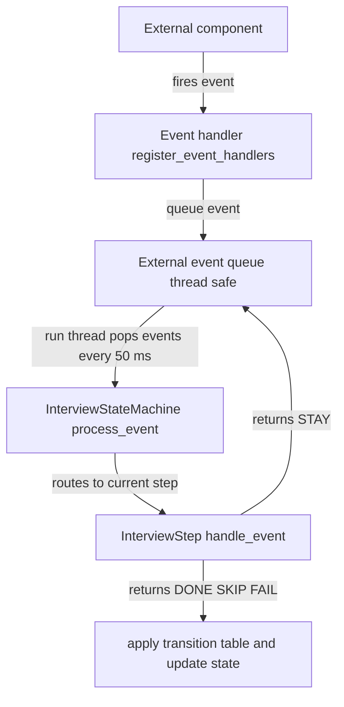

# Device Interviewer

## Overview

The Device Interviewer component is responsible for orchestrating the interview process for Z-Wave devices. It manages the sequential collection of device information including security capabilities, node information, command class versions, Z-Wave Plus Info, Wake Up configuration, association groupings, lifeline setup, association group info, and multi-channel endpoint discovery. The interview process is implemented as a state machine that ensures proper sequencing and error handling.

## Architecture

The Device Interviewer consists of three main components:

1. **`device_interviewer`** - Main component that manages the event queue and thread
2. **`InterviewStateMachine`** - State machine that manages interview sessions and state transitions
3. **`InterviewStep`** - Base class for individual interview steps that handle specific phases

### Component Structure

```
device_interviewer
├── Event Queue (thread-safe)
├── InterviewStateMachine
│   ├── InterviewSession (per node/endpoint)
│   └── Step Registry
│       ├── NodeInformationStep
│       ├── S0CommandsSupportedStep
│       ├── S2CommandsSupportedStep
│       ├── VersionReportStep
│       ├── PrepareVersionCCListStep
│       ├── VersionCCSequenceStep
│       ├── VersionGetStep
│       ├── VersionCapabilitiesInterviewStep
│       ├── VersionZwaveSoftwareInterviewStep
│       ├── ZWavePlusInfoStep
│       ├── WakeUpStep
│       ├── MultiChannelAssociationSupportedGroupingsStep
│       ├── MultiChannelAssociationSupportedGroupingsCountStep
│       ├── AssociationSupportedGroupingsStep
│       ├── AssociationGetStep
│       ├── GetAgiGroupCountStep
│       ├── AgiGroupNameGetStep
│       ├── AgiGroupInfoGetStep
│       ├── AgiGroupCommandListGetStep
│       ├── LifelineSetStep
│       ├── LifelineValidateStep
│       ├── PostValidateLifelineStep
│       ├── CheckMultiChannelSupportStep
│       ├── McEndpointGetStep
│       ├── GetNumberOfEndpointsStep
│       ├── GetEndpointCapabilitiesStep
│       ├── GetEndpointS2CapabilitiesStep
│       ├── GetEndpointS0CapabilitiesStep
│       ├── PrepareEndpointVersionsStep
│       ├── GetEndpointZwavePlusInfoStep
│       ├── EndpointAssociationIteratorStep
│       └── CompletedStep
```

### Design: Central Transition Table

All state transitions are declared in a single, central table inside `InterviewStateMachine` (defined in `interview_state_machine.cpp`). Steps **do not** hard-code their successor states; instead they return a semantic `StepResultCode`:

| Code | Meaning |
|------|---------|
| `STAY` | Waiting for an external event; no transition |
| `DONE` | Step completed via its normal path |
| `SKIP` | Step was bypassed (e.g. CC not supported / no key granted) |
| `FAIL` | Unrecoverable error; transitions directly to `FAILED` |

The state machine resolves `(current_state, result_code)` → `next_state` using the table. Adding or modifying a transition requires changing only the table.

#### Complete Transition Table

| From state | Result code | To state |
|------------|-------------|----------|
| `NODE_INFORMATION` | `DONE` | `S0_COMMANDS_SUPPORTED` |
| `S0_COMMANDS_SUPPORTED` | `DONE` | `S2_COMMANDS_SUPPORTED` |
| `S0_COMMANDS_SUPPORTED` | `SKIP` | `S2_COMMANDS_SUPPORTED` |
| `S2_COMMANDS_SUPPORTED` | `DONE` | `GET_VERSION_INFO` |
| `S2_COMMANDS_SUPPORTED` | `SKIP` | `GET_VERSION_INFO` |
| `GET_VERSION_INFO` | `DONE` | `PREPARE_VERSION_CC_LIST` |
| `GET_VERSION_INFO` | `SKIP` | `PREPARE_VERSION_CC_LIST` |
| `PREPARE_VERSION_CC_LIST` | `DONE` | `VERSION_CC_SEQUENCE` |
| `PREPARE_VERSION_CC_LIST` | `SKIP` | `GET_ZWAVEPLUS_INFO` |
| `VERSION_CC_SEQUENCE` | `DONE` | `GET_VERSION_REPORT` |
| `VERSION_CC_SEQUENCE` | `SKIP` | `GET_VERSION_CAPABILITIES` |
| `GET_VERSION_REPORT` | `DONE` | `VERSION_CC_SEQUENCE` |
| `GET_VERSION_REPORT` | `SKIP` | `GET_VERSION_CAPABILITIES` |
| `GET_VERSION_CAPABILITIES` | `DONE` | `GET_VERSION_ZWAVE_SOFTWARE` |
| `GET_VERSION_CAPABILITIES` | `SKIP` | `GET_VERSION_ZWAVE_SOFTWARE` |
| `GET_VERSION_ZWAVE_SOFTWARE` | `DONE` | `GET_ZWAVEPLUS_INFO` |
| `GET_VERSION_ZWAVE_SOFTWARE` | `SKIP` | `GET_ZWAVEPLUS_INFO` |
| `GET_ZWAVEPLUS_INFO` | `DONE` | `INTERVIEW_WAKE_UP` |
| `GET_ZWAVEPLUS_INFO` | `SKIP` | `INTERVIEW_WAKE_UP` |
| `INTERVIEW_WAKE_UP` | `DONE` | `GET_MULTI_CHANNEL_ASSOCIATION_SUPPORTED_GROUPINGS` |
| `INTERVIEW_WAKE_UP` | `SKIP` | `GET_MULTI_CHANNEL_ASSOCIATION_SUPPORTED_GROUPINGS` |
| `GET_MULTI_CHANNEL_ASSOCIATION_SUPPORTED_GROUPINGS` | `DONE` | `GET_MULTI_CHANNEL_ASSOCIATION_SUPPORTED_GROUPINGS_COUNT` |
| `GET_MULTI_CHANNEL_ASSOCIATION_SUPPORTED_GROUPINGS` | `SKIP` | `GET_ASSOCIATION_SUPPORTED_GROUPINGS` |
| `GET_MULTI_CHANNEL_ASSOCIATION_SUPPORTED_GROUPINGS_COUNT` | `DONE` | `GET_ASSOCIATION_MEMBERS` |
| `GET_ASSOCIATION_SUPPORTED_GROUPINGS` | `DONE` | `GET_ASSOCIATION_MEMBERS` |
| `GET_ASSOCIATION_SUPPORTED_GROUPINGS` | `SKIP` | `GET_AGI_GROUP_COUNT` |
| `GET_AGI_GROUP_COUNT` | `DONE` | `GET_AGI_GROUP_NAME` |
| `GET_AGI_GROUP_COUNT` | `SKIP` | `GET_AGI_GROUP_NAME` |
| `GET_ASSOCIATION_MEMBERS` | `DONE` | `GET_AGI_GROUP_NAME` |
| `GET_ASSOCIATION_MEMBERS` | `SKIP` | `GET_AGI_GROUP_NAME` |
| `GET_AGI_GROUP_NAME` | `DONE` | `GET_AGI_GROUP_INFO` |
| `GET_AGI_GROUP_NAME` | `SKIP` | `SET_LIFELINE` |
| `GET_AGI_GROUP_INFO` | `DONE` | `GET_AGI_GROUP_COMMAND_LIST` |
| `GET_AGI_GROUP_COMMAND_LIST` | `DONE` | `GET_AGI_GROUP_NAME` |
| `SET_LIFELINE` | `DONE` | `VALIDATE_LIFELINE` |
| `SET_LIFELINE` | `SKIP` | `POST_VALIDATE_LIFELINE` |
| `VALIDATE_LIFELINE` | `DONE` | `POST_VALIDATE_LIFELINE` |
| `VALIDATE_LIFELINE` | `SKIP` | `POST_VALIDATE_LIFELINE` |
| `POST_VALIDATE_LIFELINE` | `DONE` | `CHECK_MULTI_CHANNEL_SUPPORT` |
| `POST_VALIDATE_LIFELINE` | `SKIP` | `ENDPOINT_ASSOCIATION_ITERATOR` |
| `CHECK_MULTI_CHANNEL_SUPPORT` | `DONE` | `MC_ENDPOINT_GET` |
| `CHECK_MULTI_CHANNEL_SUPPORT` | `SKIP` | `COMPLETED` |
| `MC_ENDPOINT_GET` | `DONE` | `GET_NUMBER_OF_ENDPOINTS` |
| `MC_ENDPOINT_GET` | `SKIP` | `COMPLETED` |
| `GET_NUMBER_OF_ENDPOINTS` | `DONE` | `GET_ENDPOINT_CAPABILITIES` |
| `GET_NUMBER_OF_ENDPOINTS` | `SKIP` | `GET_ENDPOINT_CAPABILITIES` |
| `GET_ENDPOINT_CAPABILITIES` | `DONE` | `GET_ENDPOINT_S2_CAPABILITIES` |
| `GET_ENDPOINT_S2_CAPABILITIES` | `DONE` | `GET_ENDPOINT_S0_CAPABILITIES` |
| `GET_ENDPOINT_S2_CAPABILITIES` | `SKIP` | `GET_ENDPOINT_S0_CAPABILITIES` |
| `GET_ENDPOINT_S0_CAPABILITIES` | `DONE` | `PREPARE_ENDPOINT_VERSIONS` |
| `GET_ENDPOINT_S0_CAPABILITIES` | `SKIP` | `PREPARE_ENDPOINT_VERSIONS` |
| `PREPARE_ENDPOINT_VERSIONS` | `DONE` | `ENDPOINT_VERSION_CC_SEQUENCE` |
| `PREPARE_ENDPOINT_VERSIONS` | `SKIP` | `ENDPOINT_ZWAVEPLUS_INFO` |
| `ENDPOINT_VERSION_CC_SEQUENCE` | `DONE` | `ENDPOINT_GET_VERSION_REPORT` |
| `ENDPOINT_VERSION_CC_SEQUENCE` | `SKIP` | `ENDPOINT_ZWAVEPLUS_INFO` |
| `ENDPOINT_GET_VERSION_REPORT` | `DONE` | `ENDPOINT_VERSION_CC_SEQUENCE` |
| `ENDPOINT_ZWAVEPLUS_INFO` | `DONE` | `ENDPOINT_ASSOCIATION_ITERATOR` |
| `ENDPOINT_ZWAVEPLUS_INFO` | `SKIP` | `ENDPOINT_ASSOCIATION_ITERATOR` |
| `ENDPOINT_ASSOCIATION_ITERATOR` | `DONE` | `GET_MULTI_CHANNEL_ASSOCIATION_SUPPORTED_GROUPINGS` |
| `ENDPOINT_ASSOCIATION_ITERATOR` | `SKIP` | `COMPLETED` |

> **Note:** `NODE_DELETED` bypasses the table and transitions directly to `FAILED` — it is an external override, not a step result.

## Interview States

The interview process progresses through the following states. All interviews start at `NODE_INFORMATION` regardless of security configuration.

| State | Step | Description |
|-------|------|-------------|
| `IDLE` | - | Initial state, no active interview |
| `NODE_INFORMATION` | NodeInformationStep | Wait for Node Information Frame (entry point for all interviews) |
| `S0_COMMANDS_SUPPORTED` | S0CommandsSupportedStep | Wait for S0 Commands Supported Report (skipped if S0 not supported, S0 key not granted, or any S2 key is granted — S0 is then not highest) |
| `S2_COMMANDS_SUPPORTED` | S2CommandsSupportedStep | Wait for S2 Commands Supported Report (skipped if S2 not supported or key not granted) |
| `GET_VERSION_INFO` | VersionReportStep | Get basic Version Report (library, protocol, app version) |
| `PREPARE_VERSION_CC_LIST` | PrepareVersionCCListStep | Merge S2/S0/NIF command class lists and prepare the version CC query list |
| `VERSION_CC_SEQUENCE` | VersionCCSequenceStep | Send Version Command Class Get for next CC in the merged list |
| `GET_VERSION_REPORT` | VersionGetStep | Wait for Version Command Class Report; advances iterator and loops back |
| `GET_VERSION_CAPABILITIES` | VersionCapabilitiesInterviewStep | Version Capabilities Get / Report after per-CC Version interview (CL:0086.01.21.01.2); sets Z-Wave Software support from report |
| `GET_VERSION_ZWAVE_SOFTWARE` | VersionZwaveSoftwareInterviewStep | Version Z-Wave Software Get / Report when capabilities indicate ZWS (CL:0086.01.21.02.1) |
| `GET_ZWAVEPLUS_INFO` | ZWavePlusInfoStep | Query Z-Wave Plus Info (skipped if CC 0x5E not supported) |
| `INTERVIEW_WAKE_UP` | WakeUpStep | Interview Wake Up CC (skipped if CC 0x84 not supported): v2+ Capabilities Get/Report → Interval Set (`zpc.default_wake_up_interval`) → resolution → Interval Get → Report; v1 Set → resolution → Get → Report |
| `GET_MULTI_CHANNEL_ASSOCIATION_SUPPORTED_GROUPINGS` | MultiChannelAssociationSupportedGroupingsStep | Get Multi Channel Association Supported Groupings report (if MCA supported) |
| `GET_MULTI_CHANNEL_ASSOCIATION_SUPPORTED_GROUPINGS_COUNT` | MultiChannelAssociationSupportedGroupingsCountStep | Resolve AGI group count from MCA groupings (async); then proceed to association members |
| `GET_ASSOCIATION_SUPPORTED_GROUPINGS` | AssociationSupportedGroupingsStep | Get Association supported groupings (if Association supported, no MCA) |
| `GET_AGI_GROUP_COUNT` | GetAgiGroupCountStep | Resolve AGI group count from Association or MCA (skipped if AGI CC 0x59 not supported) |
| `GET_ASSOCIATION_MEMBERS` | AssociationGetStep | Read association members for each group |
| `GET_AGI_GROUP_NAME` | AgiGroupNameGetStep | Per-group: request Association Group Name (AGI); loops with Info and Command List |
| `GET_AGI_GROUP_INFO` | AgiGroupInfoGetStep | Per-group: request Association Group Info (AGI) |
| `GET_AGI_GROUP_COMMAND_LIST` | AgiGroupCommandListGetStep | Per-group: request Association Group Command List (AGI); then next group or SET_LIFELINE |
| `SET_LIFELINE` | LifelineSetStep | Set lifeline association (group 1) to controller |
| `VALIDATE_LIFELINE` | LifelineValidateStep | Verify lifeline was set correctly (AGI-based check if supported) |
| `POST_VALIDATE_LIFELINE` | PostValidateLifelineStep | Router: root path → CHECK_MULTI_CHANNEL_SUPPORT; endpoint path → ENDPOINT_ASSOCIATION_ITERATOR |
| `CHECK_MULTI_CHANNEL_SUPPORT` | CheckMultiChannelSupportStep | Check if Multi Channel is supported |
| `MC_ENDPOINT_GET` | McEndpointGetStep | Get Multi Channel Endpoint Report (static vs dynamic endpoints) |
| `GET_NUMBER_OF_ENDPOINTS` | GetNumberOfEndpointsStep | Discover dynamic endpoints via Endpoint Find |
| `GET_ENDPOINT_CAPABILITIES` | GetEndpointCapabilitiesStep | Get capabilities for each endpoint |
| `GET_ENDPOINT_S2_CAPABILITIES` | GetEndpointS2CapabilitiesStep | Get S2 capabilities for each endpoint |
| `GET_ENDPOINT_S0_CAPABILITIES` | GetEndpointS0CapabilitiesStep | Get S0 capabilities for each endpoint (skipped if S0 not highest granted class) |
| `PREPARE_ENDPOINT_VERSIONS` | PrepareEndpointVersionsStep | Collect endpoint CCs not yet versioned and prepare the version query loop |
| `ENDPOINT_VERSION_CC_SEQUENCE` | VersionCCSequenceStep (reused) | Send Version CC Get for next endpoint CC |
| `ENDPOINT_GET_VERSION_REPORT` | VersionGetStep (reused) | Wait for Version CC Report; advances iterator and loops back |
| `ENDPOINT_ZWAVEPLUS_INFO` | GetEndpointZwavePlusInfoStep | Per-endpoint Z-Wave Plus Info (CC 0x5E) for icon discovery |
| `ENDPOINT_ASSOCIATION_ITERATOR` | EndpointAssociationIteratorStep | Iterate endpoints: run MCA/Association + AGI + lifeline per endpoint |
| `COMPLETED` | CompletedStep | Interview completed successfully; fires INTERVIEW_DONE for root and all endpoints, then INTERVIEW_FULLY_RESOLVED once every CC's on_interview-triggered resolution has settled |
| `FAILED` | - | Interview failed (e.g. node deleted during interview) |

## State Transition Diagram

The diagram below mirrors the [Complete Transition Table](#complete-transition-table) above. State names use short aliases (defined inside the diagram) so the layout stays readable; expand any node by clicking the diagram for the magnified view.

```mermaid
stateDiagram-v2
    direction TB

    state "IDLE" as IDLE
    state "NODE_INFORMATION" as NODE_INFO
    state "S0_COMMANDS_SUPPORTED" as S0
    state "S2_COMMANDS_SUPPORTED" as S2
    state "GET_VERSION_INFO" as VER_INFO
    state "GET_VERSION_CAPABILITIES" as VER_CAP
    state "GET_VERSION_ZWAVE_SOFTWARE" as VER_SW
    state "PREPARE_VERSION_CC_LIST" as PREP_VER
    state "VERSION_CC_SEQUENCE ↔ GET_VERSION_REPORT\n(per-CC ping-pong loop)" as VER_LOOP
    state "GET_ZWAVEPLUS_INFO" as ZWPLUS
    state "INTERVIEW_WAKE_UP\n(v2: Caps→Set→res→Get→Rpt;\nv1: Set→res→Get→Rpt)" as WAKE_UP
    state "GET_MULTI_CHANNEL_ASSOCIATION_SUPPORTED_GROUPINGS" as MCA_GRP
    state "GET_MULTI_CHANNEL_ASSOCIATION_SUPPORTED_GROUPINGS_COUNT" as MCA_COUNT
    state "GET_ASSOCIATION_SUPPORTED_GROUPINGS" as ASSOC_GRP
    state "GET_ASSOCIATION_MEMBERS" as ASSOC_MEM
    state "GET_AGI_GROUP_COUNT" as AGI_COUNT
    state "GET_AGI_GROUP_NAME → GET_AGI_GROUP_INFO →\nGET_AGI_GROUP_COMMAND_LIST (per-group loop)" as AGI_LOOP
    state "SET_LIFELINE" as LIFE_SET
    state "VALIDATE_LIFELINE" as LIFE_VAL
    state "POST_VALIDATE_LIFELINE\n(router: root vs endpoint)" as POST_LIFE
    state "CHECK_MULTI_CHANNEL_SUPPORT" as MC_CHECK
    state "MC_ENDPOINT_GET" as MC_EP
    state "GET_NUMBER_OF_ENDPOINTS" as NUM_EP
    state "GET_ENDPOINT_CAPABILITIES" as EP_CAP
    state "GET_ENDPOINT_S2_CAPABILITIES" as EP_S2
    state "GET_ENDPOINT_S0_CAPABILITIES" as EP_S0
    state "PREPARE_ENDPOINT_VERSIONS" as PREP_EP_VER
    state "ENDPOINT_VERSION_CC_SEQUENCE ↔\nENDPOINT_GET_VERSION_REPORT\n(per-CC loop, reused)" as EP_VER_LOOP
    state "ENDPOINT_ZWAVEPLUS_INFO" as EP_ZWPLUS
    state "ENDPOINT_ASSOCIATION_ITERATOR" as EP_ITER
    state "COMPLETED" as DONE_S
    state "FAILED" as FAILED_S

    [*] --> IDLE
    IDLE --> NODE_INFO: start_interview()
    NODE_INFO --> S0: DONE
    S0 --> S2: DONE / SKIP
    S2 --> VER_INFO: DONE / SKIP
    VER_INFO --> PREP_VER: DONE / SKIP

    PREP_VER --> VER_LOOP: DONE
    PREP_VER --> ZWPLUS: SKIP
    VER_LOOP --> VER_CAP: SKIP\n(all CCs done)
    VER_CAP --> VER_SW: DONE / SKIP
    VER_SW --> ZWPLUS: DONE / SKIP

    ZWPLUS --> WAKE_UP: DONE / SKIP
    WAKE_UP --> MCA_GRP: DONE / SKIP

    MCA_GRP --> MCA_COUNT: DONE
    MCA_GRP --> ASSOC_GRP: SKIP
    MCA_COUNT --> ASSOC_MEM: DONE
    ASSOC_GRP --> ASSOC_MEM: DONE
    ASSOC_GRP --> AGI_COUNT: SKIP
    ASSOC_MEM --> AGI_LOOP: DONE / SKIP
    AGI_COUNT --> AGI_LOOP: DONE / SKIP
    AGI_LOOP --> LIFE_SET: all groups done

    LIFE_SET --> LIFE_VAL: DONE
    LIFE_SET --> MC_CHECK: SKIP
    LIFE_VAL --> POST_LIFE: DONE / SKIP
    POST_LIFE --> MC_CHECK: DONE\n(root)
    POST_LIFE --> EP_ITER: SKIP\n(endpoint)

    MC_CHECK --> MC_EP: DONE
    MC_CHECK --> DONE_S: SKIP
    MC_EP --> NUM_EP: DONE
    MC_EP --> DONE_S: SKIP
    NUM_EP --> EP_CAP: DONE / SKIP
    EP_CAP --> EP_S2: DONE
    EP_S2 --> EP_S0: DONE / SKIP
    EP_S0 --> PREP_EP_VER: DONE / SKIP
    PREP_EP_VER --> EP_VER_LOOP: DONE
    PREP_EP_VER --> EP_ZWPLUS: SKIP
    EP_VER_LOOP --> EP_ZWPLUS: SKIP\n(all done)
    EP_ZWPLUS --> EP_ITER: DONE / SKIP

    EP_ITER --> MCA_GRP: DONE\n(next endpoint)
    EP_ITER --> DONE_S: SKIP\n(all endpoints done)

    DONE_S --> [*]
    FAILED_S --> [*]

    note right of FAILED_S
        NODE_DELETED bypasses the
        transition table from any state.
    end note
```



## Interview Steps

### 1. NodeInformationStep (`NODE_INFORMATION`)

**Entry step for**: All interviews (single entry point)

**Conditions**: Always run; this is the single entry point for all interviews.

**Purpose**: Request and wait for Node Information Frame containing device capabilities and command class list.

**Actions on Enter**:
- Fires `COMMAND_CLASS_PROTOCOL_COMMANDS_REQUEST_NODE_INFO` event

**Handles Events**:
- `NODE_INFORMATION_RECEIVED`

**Actions on Event**:
- Stores node information in attribute store and `session.node_information_command_class_list`:
  - Listening protocol
  - Optional protocol
  - Basic/Generic/Specific device classes
  - Command class list
  - Command class list length

**Transitions**:
- `NODE_INFORMATION_RECEIVED` → `S0_COMMANDS_SUPPORTED`

### 2. S0CommandsSupportedStep (`S0_COMMANDS_SUPPORTED`)

**Conditions**: Reached after Node Information. Step is skipped if S0 (CC 0x98) is not in `node_information_command_class_list`, S0 key is not granted, or any S2 key is granted (S0 is not the highest security class).

**Purpose**: Request and wait for S0 Commands Supported Report when S0 is the highest granted class (secure CC list). When S2 is also granted, the S0 report would be empty per S2 spec — use `S2CommandsSupportedStep` instead.

**Actions on Enter**:
- If S0 (CC 0x98) not in `node_information_command_class_list`, S0 key not granted, or any S2 key granted, returns `SKIP`
- Otherwise fires `COMMAND_CLASS_S0_COMMANDS_SUPPORTED_GET` event

**Handles Events**:
- `S0_COMMANDS_SUPPORTED_REPORT`

**Actions on Event**:
- On report: stores `supported_cc_list` in `session.s0_supported_command_classes` for use by VersionCCSequenceStep

**Transitions**:
- `S0_COMMANDS_SUPPORTED_REPORT` → `S2_COMMANDS_SUPPORTED`

### 3. S2CommandsSupportedStep (`S2_COMMANDS_SUPPORTED`)

**Conditions**: Reached after S0 step (or after Node Information if S0 was skipped). Step is skipped if S2 (CC 0x9F) is not in `node_information_command_class_list` or no S2 keys are granted.

**Purpose**: Request and wait for S2 Commands Supported Report to determine which S2 command classes are supported.

**Actions on Enter**:
- If S2 (CC 0x9F) not in `node_information_command_class_list` or no S2 keys granted, returns `SKIP`
- Otherwise fires `COMMAND_CLASS_S2_COMMANDS_SUPPORTED_GET` event

**Handles Events**:
- `S2_COMMANDS_SUPPORTED_REPORT`
- `S2_COMMANDS_SUPPORTED_GET_TX_FAILED` (enqueue or air TX failure)

**Actions on Event**:
- On report: stores `supported_cc_list` in `session.s2_supported_command_classes` for use by VersionCCSequenceStep
- On TX failed: retries the Get (up to 5 attempts total), then fails the interview

**Transitions**:
- `S2_COMMANDS_SUPPORTED_REPORT` → `GET_VERSION_INFO`
- TX failures exhausted → `FAILED`

### 4. VersionReportStep (`GET_VERSION_INFO`)

**Conditions**: Reached after S2 step (or after S0 if S2 was skipped). Skipped if Version CC (0x86) is not present in any of the merged capability sources (S2 / S0 / NIF lists).

**Purpose**: Get the basic Version Report containing library type, protocol version, and application version information.

**Actions on Enter**:
- If Version CC (0x86) not in merged S2/S0/NIF lists, returns `SKIP`
- Otherwise fires `COMMAND_CLASS_VERSION_GET_INTERVIEW` event

**Handles Events**:
- `VERSION_REPORT_RECEIVED`

**Transitions**:
- Report received → `PREPARE_VERSION_CC_LIST`
- Not supported → `PREPARE_VERSION_CC_LIST`

### 4a. VersionCapabilitiesInterviewStep (`GET_VERSION_CAPABILITIES`)

**Conditions**: After the root **Version Command Class Get / Report** loop completes (`VERSION_CC_SEQUENCE` / `GET_VERSION_REPORT`). Skipped if Version CC (0x86) is not in merged S2/S0/NIF lists (same rule as PrepareVersionCCListStep).

**Purpose**: Run **Version Capabilities Get** so the Version Capabilities Report is stored **after** per-command-class Version queries, per management mandatory node interview (CL:0086.01.21.01.2).

**Actions on Enter**:
- Clears `session.version_zwave_software_supported`
- If no Version CC in merged lists → `SKIP`
- Otherwise waits for resolution kick on `handle_event(nullopt)`

**Handles Events**:
- `VERSION_CAPABILITIES_REPORT_RECEIVED` (payload includes `z_wave_software`; sets `session.version_zwave_software_supported` when non-zero)

**Transitions**:
- Capabilities report received → `GET_VERSION_ZWAVE_SOFTWARE`
- Skipped → `GET_VERSION_ZWAVE_SOFTWARE`

### 4b. VersionZwaveSoftwareInterviewStep (`GET_VERSION_ZWAVE_SOFTWARE`)

**Conditions**: After Version Capabilities step. Skipped if `session.version_zwave_software_supported` is false (Version Capabilities Report Z-Wave Software bit clear), per CL:0086.01.21.02.1.

**Purpose**: Run **Version Z-Wave Software Get** when the controlling node will use Z-Wave software version data.

**Handles Events**:
- `VERSION_ZWAVE_SOFTWARE_REPORT_RECEIVED`

**Transitions**:
- Software report received → `GET_ZWAVEPLUS_INFO`
- Skipped → `GET_ZWAVEPLUS_INFO`

### 5. PrepareVersionCCListStep (`PREPARE_VERSION_CC_LIST`)

**Conditions**: Reached after `GET_VERSION_INFO` (Version Report). Builds the merged list of command classes to version (S2 + S0 + NIF); if the list is empty or Version CC not supported, skips to Z-Wave Plus Info.

**Purpose**: Merge `session.s2_supported_command_classes`, `session.s0_supported_command_classes`, and `session.node_information_command_class_list` into `session.version_cc.command_classes_to_query`, remove duplicates, and filter invalid CCs. Prepares the iterator for the Version CC ping-pong loop.

**Actions on Enter**:
- Merges the three CC lists and stores result in `session.version_cc.command_classes_to_query`
- If list is empty or Version CC (0x86) not in list, returns `SKIP` → `GET_ZWAVEPLUS_INFO`
- Otherwise initializes version CC iteration and returns `DONE` → `VERSION_CC_SEQUENCE`

**Transitions**:
- List prepared → `VERSION_CC_SEQUENCE`
- Nothing to version → `GET_ZWAVEPLUS_INFO`

### 6. VersionCCSequenceStep (`VERSION_CC_SEQUENCE`)

**Conditions**: Reached after PrepareVersionCCListStep. Runs for the merged list of command classes in `session.version_cc.command_classes_to_query`. Forms a ping-pong loop with VersionGetStep.

**Purpose**: Send Version CC Get for the next command class in the iteration list.

**Actions on Enter**:
- If `command_classes_to_query` is empty, returns `SKIP` → `GET_VERSION_CAPABILITIES`
- If `current_cc_it` is at end (all CCs already reported), returns `SKIP` → `GET_VERSION_CAPABILITIES`
- Otherwise returns `stay()` until `handle_event(nullopt)` runs

**Actions on `handle_event(nullopt)`**:
- Fires `COMMAND_CLASS_VERSION_CC_GET` for `*current_cc_it`

**Transitions**:
- CC Get sent → `GET_VERSION_REPORT`
- All CCs queried → `GET_VERSION_CAPABILITIES`

### 7. VersionGetStep (`GET_VERSION_REPORT`)

**Conditions**: Reached from VersionCCSequenceStep after a CC Get is sent. Forms a ping-pong loop with VersionCCSequenceStep.

**Purpose**: Wait for a per-CC Version CC Report and advance the iterator.

**Handles Events**:
- `VERSION_CC_GET_REQUESTED`

**Actions on Event**:
- Validates the reported CC matches `current_cc_it`
- Advances `current_cc_it` to the next CC

**Transitions**:
- Report received → `VERSION_CC_SEQUENCE` (loops back for next CC)
- Skip → `GET_VERSION_CAPABILITIES` (aligned with `VERSION_CC_SEQUENCE` skip after the per-CC loop)

### 8. ZWavePlusInfoStep (`GET_ZWAVEPLUS_INFO`)

**Conditions**: Reached after Version Capabilities / Z-Wave Software steps (or their skips) and all per-CC Version Command Class reports. Skipped if Z-Wave Plus Info CC (0x5E) is not in `command_classes_to_query`.

**Purpose**: Query Z-Wave Plus Info from the device.

**Actions on Enter**:
- If CC 0x5E not in `command_classes_to_query`, returns `SKIP`
- Otherwise fires `COMMAND_CLASS_ZWAVEPLUS_INFO_GET_INTERVIEW` event

**Handles Events**:
- `ZWAVEPLUS_INFO_REPORT_RECEIVED`

**Transitions**:
- Report received → `INTERVIEW_WAKE_UP`
- Not supported → `INTERVIEW_WAKE_UP`

### 9. WakeUpStep (`INTERVIEW_WAKE_UP`)

**Conditions**: Reached after Z-Wave Plus Info. Skipped if Wake Up CC (0x84) is not in `command_classes_to_query`.

**Purpose**: Interview the Wake Up command class per supported CC version (from Version CC on the endpoint).

**Wake Up CC version 2+** (`session.wake_up.command_class_version >= 2`):

**Actions on Enter**:
- If CC 0x84 not in `command_classes_to_query`, returns `SKIP`
- Sets `session.wake_up.phase = PendingKick` and reads `command_class_version` from `ATTRIBUTE_COMMAND_CLASS_WAKE_UP_VERSION` (defaults to 1 if unset)

**Actions on `handle_event(nullopt)`** (first kick):
- Fires `COMMAND_CLASS_WAKE_UP_CAPABILITIES_GET_INTERVIEW` → `AwaitingCapabilitiesReport`

**Handles Events**:
- `WAKE_UP_CAPABILITIES_REPORT_RECEIVED` → fires `COMMAND_CLASS_WAKE_UP_INTERVAL_SET` with `zpc.default_wake_up_interval` and the controller node id → `AwaitingIntervalSetResolution`
- `WAKE_UP_INTERVAL_SET_RESOLUTION_COMPLETED` → `AwaitingPostSetIntervalReport` (Interval Get was queued by the Wake Up CC after Set resolution)
- `WAKE_UP_INTERVAL_REPORT_RECEIVED` (only in `AwaitingPostSetIntervalReport`) → `DONE`

**Wake Up CC version 1**:

**Actions on `handle_event(nullopt)`**:
- Fires `COMMAND_CLASS_WAKE_UP_INTERVAL_SET` (same interval and node id) → `AwaitingIntervalSetResolution` (no Capabilities Get)

**Handles Events**:
- `WAKE_UP_INTERVAL_SET_RESOLUTION_COMPLETED` → `AwaitingPostSetIntervalReport`
- `WAKE_UP_INTERVAL_REPORT_RECEIVED` (in `AwaitingPostSetIntervalReport`) → `DONE`

**Transitions**:
- Step completed → `GET_MULTI_CHANNEL_ASSOCIATION_SUPPORTED_GROUPINGS`
- Not supported → `GET_MULTI_CHANNEL_ASSOCIATION_SUPPORTED_GROUPINGS`

### 10. MultiChannelAssociationSupportedGroupingsStep (`GET_MULTI_CHANNEL_ASSOCIATION_SUPPORTED_GROUPINGS`)

**Conditions**: Reached after Wake Up step. Fires only if Multi Channel Association (CC 0x8E) is present in `session.version_cc.command_classes_to_query`.

**Purpose**: Request Multi Channel Association Supported Groupings Get when the device supports Multi Channel Association (CC 0x8E) per NIF or S2. The report is consumed by the attribute store; the next step resolves the group count.

**Actions on Enter**:
- If Multi Channel Association (CC 0x8E) not in `command_classes_to_query` → returns `SKIP` → `GET_ASSOCIATION_SUPPORTED_GROUPINGS`
- Otherwise fires `COMMAND_CLASS_MULTI_CHANNEL_ASSOCIATION_GROUPINGS_GET` event → returns `STAY`

**Handles Events**:
- `MULTI_CHANNEL_ASSOCIATION_SUPPORTED_GROUPINGS_REPORT_RECEIVED`

**Actions on Event**:
- Report is stored by the command class; step returns `DONE` → `GET_MULTI_CHANNEL_ASSOCIATION_SUPPORTED_GROUPINGS_COUNT`

**Transitions**:
- Report received → returns `DONE` → `GET_MULTI_CHANNEL_ASSOCIATION_SUPPORTED_GROUPINGS_COUNT` (via transition table)
- Not supported → returns `SKIP` → `GET_ASSOCIATION_SUPPORTED_GROUPINGS` (via transition table)

### 11. MultiChannelAssociationSupportedGroupingsCountStep (`GET_MULTI_CHANNEL_ASSOCIATION_SUPPORTED_GROUPINGS_COUNT`)

**Conditions**: Reached only when Multi Channel Association Supported Groupings step completed (device supports MCA). Waits for the MCA Supported Groupings report to obtain the group count.

**Purpose**: Trigger MCA Groupings Get (to resolve the count via attribute resolver if needed) and wait for `MULTI_CHANNEL_ASSOCIATION_SUPPORTED_GROUPINGS_REPORT_RECEIVED`. Sets `session.agi.agi_used_multi_channel = true` and `session.agi.agi_total_groups` from the report payload, then transitions to GET_ASSOCIATION_MEMBERS.

**Actions on Enter**:
- Returns `STAY` (wait for event)

**Handles Events**:
- When no event (first tick): fires `COMMAND_CLASS_MULTI_CHANNEL_ASSOCIATION_GROUPINGS_GET` to trigger group resolution, returns `STAY`
- `MULTI_CHANNEL_ASSOCIATION_SUPPORTED_GROUPINGS_REPORT_RECEIVED`: sets `session.agi.agi_total_groups` and `session.agi.agi_used_multi_channel = true`, returns `DONE`

**Transitions**:
- Report received → `GET_ASSOCIATION_MEMBERS`

### 12. AssociationSupportedGroupingsStep (`GET_ASSOCIATION_SUPPORTED_GROUPINGS`)

**Conditions**: Reached when Multi Channel Association step was skipped (device has no MCA). Fires only if the device has Association (CC 0x85) but not Multi Channel Association (CC 0x8E) in `command_classes_to_query`.

**Purpose**: Request Association Supported Groupings Get when the device supports Association (CC 0x85) but not Multi Channel Association, per NIF or S2.

**Actions on Enter**:
- If Association (CC 0x85) not in `command_classes_to_query`, or MCA is present → returns `SKIP` → `SET_LIFELINE`
- Otherwise fires `COMMAND_CLASS_ASSOCIATION_GROUPINGS_GET` event → returns `STAY`

**Handles Events**:
- `ASSOCIATION_SUPPORTED_GROUPINGS_REPORT_RECEIVED`

**Actions on Event**:
- Sets `session.agi.agi_used_multi_channel = false`
- Sets `session.agi.agi_total_groups` from the report

**Transitions**:
- Report received → returns `DONE` → `GET_ASSOCIATION_MEMBERS` (via transition table)
- Not supported → returns `SKIP` → `GET_AGI_GROUP_COUNT` (via transition table)

### 13. GetAgiGroupCountStep (`GET_AGI_GROUP_COUNT`)

**Conditions**: Reached when Association Supported Groupings step was skipped (no Association CC or device has MCA). Runs only if Association Group Info (CC 0x59) is in `command_classes_to_query` and `session.agi.agi_total_groups` is not already set.

**Purpose**: Obtain the association group count from either Multi Channel Association or Association CC (via `fire_event_async` and `future.get()`) so the interview can later query Name, Info, and Command List for each group. Sets `session.agi.agi_used_multi_channel` and `session.agi.agi_total_groups`.

**Actions on Enter**:
- If AGI (CC 0x59) not in `command_classes_to_query`, returns `SKIP` → `GET_AGI_GROUP_NAME`
- If `session.agi.agi_total_groups > 0` (already set, e.g. from MCA path), returns `SKIP` → `GET_AGI_GROUP_NAME`
- Otherwise returns `STAY`

**Handles Events**:
- When no event (first tick): fires `COMMAND_CLASS_MULTI_CHANNEL_ASSOCIATION_SUPPORTED_GROUPINGS_COUNT` or `COMMAND_CLASS_ASSOCIATION_SUPPORTED_GROUPINGS_COUNT` (depending on whether MCA is in CC list), waits synchronously for result, sets `session.agi.agi_total_groups` and `session.agi.agi_used_multi_channel`, returns `DONE`

**Transitions**:
- Count resolved → `GET_AGI_GROUP_NAME`
- AGI not supported or already have count → `GET_AGI_GROUP_NAME`

### 14. AssociationGetStep (`GET_ASSOCIATION_MEMBERS`)

**Conditions**: Reached after a groupings report (from either MCA or Association step). Skipped if `agi_total_groups == 0`.

**Purpose**: Read association members for each group using either Multi Channel Association Get or Association Get (depending on `session.agi.agi_used_multi_channel`).

**Actions on Enter**:
- If `agi_total_groups == 0`, returns `SKIP`
- Sets `session.association_members.assoc_current_group_id = 1`
- Fires Association Get or Multi Channel Association Get for group 1

**Handles Events**:
- `ASSOCIATION_REPORT_RECEIVED`
- `MULTI_CHANNEL_ASSOCIATION_REPORT_RECEIVED`

**State Management**:
- Iterates through groups 1 to `agi_total_groups`
- Group tracked via `session.association_members.assoc_current_group_id`

**Transitions**:
- All groups read → `GET_AGI_GROUP_NAME`
- No groups → `GET_AGI_GROUP_NAME`

### 15. AgiGroupNameGetStep (`GET_AGI_GROUP_NAME`)

**Conditions**: Reached after association members (or AGI group count). Runs for each association group when AGI (CC 0x59) is supported and `agi_total_groups > 0`. Forms a per-group loop with AgiGroupInfoGetStep and AgiGroupCommandListGetStep.

**Purpose**: For the current group (`session.agi.agi_current_group_id`), request Association Group Name Get. When the report is received, transition to GET_AGI_GROUP_INFO for the same group.

**Handles Events**:
- `ASSOCIATION_GRP_INFO_GROUP_NAME_REPORT_RECEIVED`

**State Management**:
- Group ID tracked via `session.agi.agi_current_group_id` (1-based). After Command List for a group is received, advance to next group and return to GET_AGI_GROUP_NAME; when all groups are done, transition to SET_LIFELINE.

**Transitions**:
- Report received → `GET_AGI_GROUP_INFO`
- No AGI or 0 groups → `SET_LIFELINE`

### 16. AgiGroupInfoGetStep (`GET_AGI_GROUP_INFO`)

**Conditions**: Reached from GET_AGI_GROUP_NAME after the group name report for the current group.

**Purpose**: For the current group, request Association Group Info Get. When the report is received, transition to GET_AGI_GROUP_COMMAND_LIST.

**Handles Events**:
- `ASSOCIATION_GRP_INFO_GROUP_INFO_REPORT_RECEIVED`

**Transitions**:
- Report received → `GET_AGI_GROUP_COMMAND_LIST`

### 17. AgiGroupCommandListGetStep (`GET_AGI_GROUP_COMMAND_LIST`)

**Conditions**: Reached from GET_AGI_GROUP_INFO after the group info report for the current group.

**Purpose**: For the current group, request Association Group Command List Get. When the report is received, either advance to the next group (→ GET_AGI_GROUP_NAME) or, if no more groups, transition to SET_LIFELINE.

**Handles Events**:
- `ASSOCIATION_GRP_INFO_GROUP_COMMAND_LIST_REPORT_RECEIVED`

**Transitions**:
- Report received → `GET_AGI_GROUP_NAME` (next group or exit loop to SET_LIFELINE when all groups done)

### 18. LifelineSetStep (`SET_LIFELINE`)

**Conditions**: Reached after association members have been read (or skipped). Skipped if Z-Wave Plus CC (0x5E) is not supported or controller NodeID is unknown.

**Purpose**: Set the lifeline association (group 1) to the controller node ID.

**Actions on Enter**:
- If Z-Wave Plus CC (0x5E) not in `command_classes_to_query` or controller NodeID unknown, returns `SKIP`
- Otherwise fires Association Set or Multi Channel Association Set for group 1 with controller NodeID (depending on `session.agi.agi_used_multi_channel`)

**Transitions**:
- Set sent → `VALIDATE_LIFELINE`
- Skipped (no association groups / not applicable) → `POST_VALIDATE_LIFELINE` (routes root → `CHECK_MULTI_CHANNEL_SUPPORT`, endpoint → `ENDPOINT_ASSOCIATION_ITERATOR`)

### 19. LifelineValidateStep (`VALIDATE_LIFELINE`)

**Conditions**: Reached after LifelineSetStep when lifeline was set (DONE path). Waits briefly then requests Association Get or Multi Channel Association Get for group 1 (lifeline) to verify the set was applied.

**Purpose**: Verify that the lifeline (group 1) is set to the controller by requesting the current association members and confirming the report is received for the correct endpoint and grouping identifier.

**Actions on Enter**:
- Short delay (workaround so SET is processed before GET), then returns `STAY`

**Handles Events**:
- When no event: fires Association Get or MCA Get for group 1 (lifeline), returns `STAY`
- `ASSOCIATION_REPORT_RECEIVED` or `MULTI_CHANNEL_ASSOCIATION_REPORT_RECEIVED`: if payload matches session endpoint and grouping identifier 1, returns `DONE`; otherwise ignores

**Transitions**:
- Lifeline report received for group 1 → `POST_VALIDATE_LIFELINE`

### 20. PostValidateLifelineStep (`POST_VALIDATE_LIFELINE`)

**Conditions**: Reached after VALIDATE_LIFELINE. Synchronous router step.

**Purpose**: If `session.endpoint_id != 0` we just finished lifeline validation for an endpoint → return SKIP → `ENDPOINT_ASSOCIATION_ITERATOR` (next endpoint or COMPLETED). If `session.endpoint_id == 0` (root) → return DONE → `CHECK_MULTI_CHANNEL_SUPPORT`.

### 21. CheckMultiChannelSupportStep (`CHECK_MULTI_CHANNEL_SUPPORT`)

**Conditions**: Reached after POST_VALIDATE_LIFELINE (root path). No skip condition; always runs. Result determines next state: Multi Channel supported → endpoint discovery; not supported → `COMPLETED`.

**Purpose**: Check if the device supports Multi Channel command class (CC 0x60).

**Actions on Enter**:
- If CC 0x60 in `command_classes_to_query`, returns `DONE`
- Otherwise returns `SKIP`

**Transitions**:
- Multi Channel supported → `MC_ENDPOINT_GET`
- Not supported → `COMPLETED`

### 22. McEndpointGetStep (`MC_ENDPOINT_GET`)

**Conditions**: Reached only when Multi Channel support was confirmed.

**Purpose**: Get Multi Channel Endpoint Report to determine whether endpoints are static or dynamic.

**Actions on Enter**:
- Fires `COMMAND_CLASS_MULTI_CHANNEL_END_POINT_GET_INTERVIEW` event

**Handles Events**:
- `MULTI_CHANNEL_END_POINT_REPORT_RECEIVED`

**Actions on Event**:
- If 0 individual endpoints, returns `SKIP`
- Sets `session.multi_channel.mc_has_dynamic_endpoints`
- For static endpoints: fills `session.endpoints.endpoint_ids` and sets `session.endpoints.current_endpoint_it`

**Transitions**:
- No endpoints → `COMPLETED`
- Static endpoints populated → `GET_NUMBER_OF_ENDPOINTS`

### 23. GetNumberOfEndpointsStep (`GET_NUMBER_OF_ENDPOINTS`)

**Conditions**: Reached after McEndpointGetStep. If `endpoint_ids` is already populated (static case), skips Endpoint Find.

**Purpose**: Discover dynamic endpoints via Multi Channel End Point Find when `endpoint_ids` is empty.

**Actions on Enter**:
- If `endpoint_ids` not empty (static endpoints), returns `DONE` immediately
- Otherwise fires `COMMAND_CLASS_MULTI_CHANNEL_END_POINT_FIND` event

**Handles Events**:
- `MULTI_CHANNEL_END_POINT_FIND_REPORT_RECEIVED`

**Actions on Event**:
- Stores endpoint IDs in `session.endpoints.endpoint_ids`
- Sets `session.endpoints.current_endpoint_it` to first endpoint

**Transitions**:
- No endpoints found → `COMPLETED`
- Endpoints found → `GET_ENDPOINT_CAPABILITIES`

### 24. GetEndpointCapabilitiesStep (`GET_ENDPOINT_CAPABILITIES`)

**Conditions**: Reached only when at least one endpoint was reported.

**Purpose**: Get Multi Channel Commands Capability for each endpoint.

**Actions on Enter**:
- Sends `COMMAND_CLASS_MULTI_CHANNEL_COMMANDS_CAPABILITY_GET` for first endpoint

**Handles Events**:
- `MULTI_CHANNEL_COMMANDS_CAPABILITY_REPORT_RECEIVED`

**State Management**:
- Uses iterator `current_endpoint_it` over `endpoint_ids` (sequential)

**Transitions**:
- While more endpoints → stays, sends GET for next
- All received → `GET_ENDPOINT_S2_CAPABILITIES`

### 25. GetEndpointS2CapabilitiesStep (`GET_ENDPOINT_S2_CAPABILITIES`)

**Conditions**: Reached after all endpoint capabilities have been received. Skipped if `endpoint_ids` is empty.

**Purpose**: Get S2 Commands Supported for each endpoint.

**Actions on Enter**:
- If `endpoint_ids` empty, returns `SKIP`
- Sends `COMMAND_CLASS_S2_COMMANDS_SUPPORTED_GET` for first endpoint

**Handles Events**:
- `S2_COMMANDS_SUPPORTED_REPORT`
- `S2_COMMANDS_SUPPORTED_GET_TX_FAILED` (retries up to 5 attempts per endpoint, then fails interview)

**State Management**:
- Uses iterator `current_endpoint_it` over `endpoint_ids` (sequential)

**Transitions**:
- While more endpoints → stays, sends GET for next
- TX failures exhausted → `FAILED`
- All received → `GET_ENDPOINT_S0_CAPABILITIES`

### 26. GetEndpointS0CapabilitiesStep (`GET_ENDPOINT_S0_CAPABILITIES`)

**Conditions**: Reached after S2 endpoint capabilities. Skipped if `endpoint_ids` is empty, S0 key was not granted, or any S2 key is granted (S0 is not the highest security class).

**Purpose**: Get S0 Commands Supported for each endpoint when S0 is the highest granted class.

**Actions on Enter**:
- If `endpoint_ids` empty, S0 key not granted, or any S2 key granted, returns `SKIP`
- Sends `COMMAND_CLASS_S0_COMMANDS_SUPPORTED_GET` for first endpoint

**Handles Events**:
- `S0_COMMANDS_SUPPORTED_REPORT`

**State Management**:
- Uses iterator `current_endpoint_it` over `endpoint_ids` (sequential)
- Mis-matched endpoint reports (e.g. root EP0 reply to an endpoint Get) skip the current endpoint so the step cannot stall

**Transitions**:
- While more endpoints → stays, sends GET for next
- All received (or skipped after mis-match) → `PREPARE_ENDPOINT_VERSIONS`

### 27. PrepareEndpointVersionsStep (`PREPARE_ENDPOINT_VERSIONS`)

**Conditions**: Reached after endpoint S0/S2 capabilities. Skipped if no endpoints exist or all endpoint CCs were already versioned during the root device interview.

**Purpose**: Check if endpoint S2/S0 reports discovered command classes not already versioned during the root device interview. Sets up `command_classes_to_query` and `current_cc_it` for the endpoint version ping-pong loop.

**Actions on Enter**:
- Compares `session.endpoints.endpoint_discovered_command_classes` (accumulated during GET_ENDPOINT_S2/S0 steps) against `session.version_cc.command_classes_to_query` (already versioned)
- If new CCs found: replaces `command_classes_to_query`, sets `current_cc_it` → `DONE`
- If no new CCs → `SKIP`

**Transitions**:
- New CCs to version → `ENDPOINT_VERSION_CC_SEQUENCE`
- No new CCs → `ENDPOINT_ZWAVEPLUS_INFO`

### 28. Endpoint Version CC Loop (`ENDPOINT_VERSION_CC_SEQUENCE` / `ENDPOINT_GET_VERSION_REPORT`)

**Conditions**: Reached when `PrepareEndpointVersionsStep` found endpoint CCs not yet versioned.

**Purpose**: Query Version CC Get/Report for each new endpoint CC. Reuses `VersionCCSequenceStep` and `VersionGetStep` class instances with endpoint-specific transitions.

**Transitions**:
- `ENDPOINT_VERSION_CC_SEQUENCE` → DONE → `ENDPOINT_GET_VERSION_REPORT` (send get, wait for report)
- `ENDPOINT_GET_VERSION_REPORT` → DONE → `ENDPOINT_VERSION_CC_SEQUENCE` (loop for next CC)
- `ENDPOINT_VERSION_CC_SEQUENCE` → SKIP → `ENDPOINT_ZWAVEPLUS_INFO` (all endpoint CCs versioned)

### 29. GetEndpointZwavePlusInfoStep (`ENDPOINT_ZWAVEPLUS_INFO`)

**Conditions**: Reached after endpoint version phase (PREPARE_ENDPOINT_VERSIONS SKIP or ENDPOINT_VERSION_CC_SEQUENCE SKIP). Skipped if no endpoints or Z-Wave Plus Info CC (0x5E) not in `command_classes_to_query`.

**Purpose**: Per Z-Wave Plus Info v2 spec, query Z-Wave Plus Info for each endpoint to advertise individual icons. Iterates over `session.endpoints.endpoint_ids`, sends ZWAVEPLUS_INFO_GET per endpoint, waits for ZWAVEPLUS_INFO_REPORT_RECEIVED.

- All endpoints queried → `ENDPOINT_ASSOCIATION_ITERATOR`
- No endpoints or CC 0x5E not supported → `ENDPOINT_ASSOCIATION_ITERATOR` (skip)

### 30. EndpointAssociationIteratorStep (`ENDPOINT_ASSOCIATION_ITERATOR`)

**Conditions**: Reached after ENDPOINT_ZWAVEPLUS_INFO. Runs the same Association/MCA + AGI + lifeline chain for each endpoint by setting `session.endpoint_node` and `session.endpoint_id` to each endpoint in turn.

**Purpose**: Per-endpoint Association/MCA and AGI interview. On first enter: set session to first endpoint, return DONE → `GET_MULTI_CHANNEL_ASSOCIATION_SUPPORTED_GROUPINGS`. When re-entered after VALIDATE_LIFELINE (session.endpoint_id != 0): advance to next endpoint or restore root and return SKIP → `COMPLETED`.

**Per-endpoint scoping**: Before re-entering the association chain for an endpoint, this step:
- Resets AGI/association session progress (`agi_total_groups`, `agi_used_multi_channel`, group iterators) so root interview state is not reused
- Rebuilds `session.version_cc.command_classes_to_query` from that endpoint’s Multi Channel Capability Report (authoritative). Falls back to Secure NIF / NIF only if no capability report CC list is present.

Existing MCA / Association / AGI gates then skip naturally when the endpoint does not advertise those CCs.

- More endpoints → `GET_MULTI_CHANNEL_ASSOCIATION_SUPPORTED_GROUPINGS` (same chain for next endpoint)
- No endpoints or all done → `COMPLETED`

### 31. CompletedStep (`COMPLETED`)

**Conditions**: Final state; reached after the interview flow completes or when Multi Channel is not supported.

**Purpose**: Final state indicating interview completion. Fires two events with distinct semantics so that command classes can run their `on_interview` post-interview hooks before the user-visible "interview done" signal is published:

1. `COMPONENT_CONNECTOR_INTERVIEW_DONE` — synchronous trigger for command classes' `on_interview` hooks. Fired per endpoint so each CC can queue any post-interview attribute resolutions.
2. `COMPONENT_CONNECTOR_INTERVIEW_FULLY_RESOLVED` — fired once the entire device subtree is resolved (i.e. every `on_interview`-triggered transaction has completed). This is the signal MQTT clients (and other consumers that need the device to be fully ready) should listen to.

**Actions on Enter**:
- Logs completion status
- Fires `COMPONENT_CONNECTOR_INTERVIEW_DONE` with `SL_STATUS_OK` synchronously (`fire_event_async` + `.get()`) for the root endpoint (`session.endpoint_node`) and for each endpoint in `session.endpoints.endpoint_ids`. Synchronous dispatch ensures every CC has called `on_interview` (and queued its resolutions) before the next step.
- Installs an attribute resolver listener on `session.device_node` (the NodeID node). When the listener fires it does **not** immediately publish; instead it defers ~100 ms via `attribute_timeout_set_callback` and re-checks `attribute_resolver_node_or_child_needs_resolution`. If any node picked up a new pending resolution in the grace window — e.g. `command_class_switch_color` chaining the next colour component get from `on_switch_color_report_parsed` — the listener is re-armed and the device keeps interviewing. Only when the subtree is genuinely settled does the step iterate the `ATTRIBUTE_ENDPOINT_ID` children and fire `COMPONENT_CONNECTOR_INTERVIEW_FULLY_RESOLVED` per endpoint. This is the same defer-and-recheck pattern used by `command_class_wake_up` for "no more information".

**Handles Events**:
- None (no events processed in completed state)

## Events

### Event Types

| Event | Description | Payload Type |
|-------|-------------|--------------|
| `NODE_DELETED` | Node deleted; fail interview | `component_connector_node_deleted_payload_t` |
| `S2_COMMANDS_SUPPORTED_REPORT` | S2 Commands Supported Report received | `s2_supported_report_payload_t` |
| `S2_COMMANDS_SUPPORTED_GET_TX_FAILED` | S2 Commands Supported Get enqueue/air TX failed | `s2_supported_get_tx_failed_payload_t` |
| `S0_COMMANDS_SUPPORTED_REPORT` | S0 Commands Supported Report received | `s0_supported_report_payload_t` |
| `NODE_INFORMATION_RECEIVED` | Node Information Frame received | `component_connector_node_information_received_payload_t` |
| `VERSION_REPORT_RECEIVED` | Version Report received (library/protocol/app version) | `command_class_version_report_callback_payload_t` |
| `VERSION_CAPABILITIES_REPORT_RECEIVED` | Version Capabilities Report received (includes Z-Wave Software bit) | `command_class_version_capabilities_report_callback_payload_t` |
| `VERSION_ZWAVE_SOFTWARE_REPORT_RECEIVED` | Version Z-Wave Software Report received | `command_class_version_report_callback_payload_t` |
| `VERSION_CC_GET_REQUESTED` | Version CC Get requested (internal) | `command_class_version_cc_get_payload_t` |
| `ZWAVEPLUS_INFO_REPORT_RECEIVED` | Z-Wave Plus Info Report received | `zwaveplus_info_report_payload_t` |
| `WAKE_UP_CAPABILITIES_REPORT_RECEIVED` | Wake Up Capabilities Report received | `wake_up_capabilities_report_payload_t` |
| `WAKE_UP_INTERVAL_SET_RESOLUTION_COMPLETED` | Interview Interval Set attribute resolution completed (before Interval Get) | `wake_up_interval_set_interview_resolution_payload_t` |
| `WAKE_UP_INTERVAL_REPORT_RECEIVED` | Wake Up Interval Report received | `wake_up_interval_report_payload_t` |
| `MULTI_CHANNEL_END_POINT_REPORT_RECEIVED` | Multi Channel End Point Report | `command_class_multi_channel_end_point_report_payload_t` |
| `MULTI_CHANNEL_END_POINT_FIND_REPORT_RECEIVED` | Multi Channel End Point Find Report | `command_class_multi_channel_end_point_find_report_payload_t` |
| `MULTI_CHANNEL_COMMANDS_CAPABILITY_REPORT_RECEIVED` | Multi Channel Commands Capability Report | `command_class_multi_channel_commands_capability_report_payload_t` |
| `MULTI_CHANNEL_ASSOCIATION_SUPPORTED_GROUPINGS_REPORT_RECEIVED` | Multi Channel Association Groupings Report received | `component_connector_multi_channel_association_groupings_get_payload_t` |
| `ASSOCIATION_SUPPORTED_GROUPINGS_REPORT_RECEIVED` | Association Groupings Report received | `component_connector_association_groupings_get_payload_t` |
| `ASSOCIATION_REPORT_RECEIVED` | Association Report (per-group members) received | `component_connector_association_report_payload_t` |
| `MULTI_CHANNEL_ASSOCIATION_REPORT_RECEIVED` | Multi Channel Association Report (per-group members) received | `component_connector_multi_channel_association_report_payload_t` |
| `ASSOCIATION_GRP_INFO_GROUP_NAME_REPORT_RECEIVED` | AGI Group Name Report received | `component_connector_agi_groupings_payload_t` |
| `ASSOCIATION_GRP_INFO_GROUP_INFO_REPORT_RECEIVED` | AGI Group Info Report received | `component_connector_agi_groupings_payload_t` |
| `ASSOCIATION_GRP_INFO_GROUP_COMMAND_LIST_REPORT_RECEIVED` | AGI Group Command List Report received | `component_connector_agi_groupings_payload_t` |

### Event Flow



## Interview Session

Each interview maintains a session (`InterviewSession`) that tracks:

- **Node/Endpoint**: `node_id`, `endpoint_id`
- **State**: Current interview state
- **Attribute Store Nodes**: `device_node`, `endpoint_node`
- **Node Information**: `node_information_command_class_list` (stored by NodeInformationStep)
- **S2 Capabilities**: `s2_supported_command_classes` (stored by S2CommandsSupportedStep)
- **S0 Capabilities**: `s0_supported_command_classes` (stored by S0CommandsSupportedStep)
- **Version CC Collection**:
  - `command_classes_to_query`: Merged list of CCs to query (built from S2 + S0 + NIF lists)
  - `current_cc_it`: Iterator to CC we're waiting for
  - `version_zwave_software_supported`: From Version Capabilities Report (after per-CC Version loop); drives Version Z-Wave Software Get step
- **Wake Up**:
  - `wake_up_phase`: Sub-state (`PendingKick` → `AwaitingCapabilitiesReport` for v2+ → `AwaitingIntervalSetResolution` → `AwaitingPostSetIntervalReport`, or v1: `PendingKick` → `AwaitingIntervalSetResolution` → `AwaitingPostSetIntervalReport`)
  - `wake_up.command_class_version`: Wake Up CC version from the attribute store (used to choose v1 vs v2+ flow)
- **Multi Channel**:
  - `mc_has_dynamic_endpoints`: Whether endpoints are dynamic (from Endpoint Report)
  - `endpoint_ids`: List of discovered endpoint IDs
  - `current_endpoint_it`: Iterator to endpoint we're waiting for
- **Association**:
  - `assoc_current_group_id`: Current group being read in `GET_ASSOCIATION_MEMBERS` step (1-based)
- **Association Group Info**:
  - `agi_used_multi_channel`: `true` if groupings came from Multi Channel Association step
  - `agi_total_groups`: Total association groups to query
  - `agi_current_group_id`: Current group being queried (1-based). Per-group flow is driven by states GET_AGI_GROUP_NAME → GET_AGI_GROUP_INFO → GET_AGI_GROUP_COMMAND_LIST → (next group or SET_LIFELINE)
- **Security**: `granted_keys`

## Starting an Interview

Interviews are started automatically when:

1. `COMPONENT_CONNECTOR_NODE_ADDED` event is received
2. `status == SL_STATUS_OK` and `kex_fail_type == KEX_FAIL_NONE`
3. Node exists in attribute store
4. Endpoint 0 exists

Interview eligibility is based on add **status/kex_fail**, not security level: non-secure (`granted_keys == 0`) and lower-security successes still start an interview. S0/S2 interview steps skip when the NIF or `granted_keys` does not support them; S0 Commands Supported Get is also skipped when any S2 key is granted (S0 is not the highest class — secure CCs come from the S2 report).

S2/S0 bootstrapping failure (`kex_fail_type != none` or non-OK `status`) does **not** start an interview. Classic and SmartStart then self-destruct/remove the ghost node so a clean reinclude can retry.

## Interview stall abort

Sessions track `last_progress_at` on every state transition. If no progress for too long, `abort_stale_sessions()` (from the interviewer `run()` loop) fires `COMPONENT_CONNECTOR_INTERVIEW_FULLY_RESOLVED` with `status = FAIL` (no `INTERVIEW_DONE`) and erases the session. Network monitor maps non-OK FULLY_RESOLVED to `ONLINE_NON_FUNCTIONAL`.

| Node type | Stall timeout |
|-----------|---------------|
| AL / FL | **60 s** |
| NL | **max(2 × `zpc.default_wake_up_interval`, 15 min)** (default config: 2 × 4200 s ≈ 140 min; floor prevents tiny intervals such as 5 or 30 from aborting NL in seconds) |

NL uses the longer window so Wake Up waits can span sleep cycles, with a **15-minute floor** so test configs with a short `default_wake_up_interval` cannot collapse the NL wait. Step `fail()` — e.g. S2 Commands Supported Get TX retries exhausted — still publishes `INTERVIEW_FULLY_RESOLVED` (FAIL) and erases the session immediately for all node types.

All interviews start at `NODE_INFORMATION` and progress through S0 and S2 steps (which may skip if the corresponding command class is not supported).

## Cancelling an Interview

Interviews are cancelled when:

1. `COMPONENT_CONNECTOR_NODE_DELETED` event is received
2. Node is being excluded from the network

**Cancellation Process**:
1. Fire `COMPONENT_CONNECTOR_INTERVIEW_FULLY_RESOLVED` with `status = FAIL` (publishes MQTT `Interview/Report`)
2. Erase the session

## Error Handling

### Step failure (`fail()`)
- S2 Commands Supported Get (and other steps) that return `fail()` after retries publish `INTERVIEW_FULLY_RESOLVED` (FAIL) and erase the session immediately (all node types; complements the stall abort).

### Stale Events
- Events for nodes without active interviews are ignored
- Events for cancelled/failed sessions are ignored
- Events arriving in wrong state are logged and ignored

### Unexpected Responses
- Steps use sequential iterator-based flow; only one request in flight at a time
- Unexpected reports (wrong CC/endpoint, duplicate, stale) are logged and ignored
- Session stays in state waiting for the expected response

## Thread Safety

The Device Interviewer runs on a dedicated thread:

- **External Event Queue**: Thread-safe queue (`safe_queue`) for external events
- **Event Handlers**: Registered in `register_event_handlers()` and queue events
- **Main Loop**: `run()` method pops events from `external_event_queue` on dedicated thread (50ms timeout)
- **State Machine**: All state transitions happen on the interviewer thread

## Attribute Store Integration

The Device Interviewer stores interview data in the attribute store under:

```
Device Node
└── Endpoint 0
    └── NODE_INFORMATION_GROUP
        ├── listening_protocol
        ├── optional_protocol
        ├── basic_device_class
        ├── generic_device_class
        ├── specific_device_class
        ├── command_class_list
        └── command_class_list_length
```

## MQTT API

Topic names, direction, and payload schemas are in [Device Interview MQTT API](interview_mqtt_api.md).
On-demand interview is requested via [NETWORK_NODE_INTERVIEW](../../network_manager/doc/network_management_mqtt_api.md#network_node_interview).

## Synchronous Operations

Some operations don't require the state machine:

- **GET_NODE_INFORMATION**: Synchronous read operation handled directly in `on_get_node_information()`

## Dependencies

The Device Interviewer depends on:

- **Component Connector**: For event communication
- **Attribute Store**: For data persistence
- **Command Classes**: S2, S0, Protocol, Version, Multi Channel, Association, Multi Channel Association, Association Group Info, Z-Wave Plus Info, Wake Up command classes
- **Threading**: For thread-safe event processing

## Logging

The component uses the following log tags:

- `device_interviewer`: Main component logging
- `interview_state_machine`: State machine transitions
- `interview_steps`: Step-specific logging
