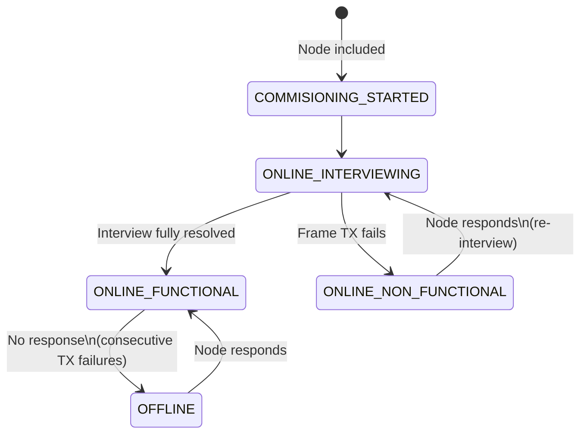
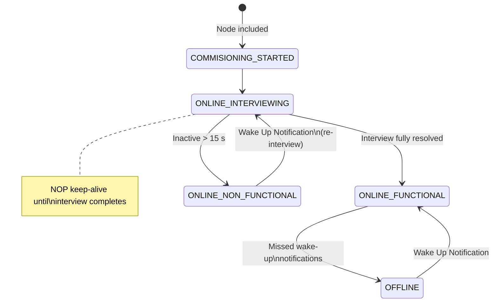

# Network Status

The Network Monitor tracks the availability of Z-Wave nodes on the network and
publishes **unsolicited** status reports over MQTT whenever a node's status
changes. No request is needed from the client; the report is emitted
automatically as soon as the Network Monitor detects a transition.

The monitor handles Always-Listening (AL), FLiRS (FL) and Non-Listening (NL)
devices, each with behaviour tailored to their communication model.

MQTT topic and payload schemas are in [Network Status MQTT API](network_status_mqtt_api.md).

## Status Values

| Enum                                              | Value | MQTT String | Description                                                                                                      |
|---------------------------------------------------|-------|-------------|------------------------------------------------------------------------------------------------------------------|
| `NETWORK_MONITOR_NETWORK_STATUS_ONLINE_FUNCTIONAL`    | 0     | `"online"`  | The node is reachable and fully operational.                                                                     |
| `NETWORK_MONITOR_NETWORK_STATUS_ONLINE_INTERVIEWING`  | 1     | `"unknown"` | The node is reachable but currently being interviewed (capabilities discovery in progress).                       |
| `NETWORK_MONITOR_NETWORK_STATUS_ONLINE_NON_FUNCTIONAL`| 2     | `"unknown"` | The node was being interviewed but failed. AL/FL: re-interview when the node responds on TX/RX. NL: re-interview on the next Wake Up Notification only. |
| `NETWORK_MONITOR_NETWORK_STATUS_UNAVAILABLE`          | 3     | `"unknown"` | The node's status has not been determined yet (default until first communication).                                |
| `NETWORK_MONITOR_NETWORK_STATUS_OFFLINE`              | 4     | `"offline"` | The node is unreachable / not responding to frames.                                                              |
| `NETWORK_MONITOR_NETWORK_STATUS_COMMISIONING_STARTED` | 5     | `"unknown"` | The node has just been included and commissioning is in progress.                                                 |

## Lifecycle — Always-Listening (AL) Devices

### Key Transitions (AL)

- **Device becomes unavailable**: When the Network Monitor detects that a node
  is no longer responding, the status transitions to `OFFLINE`, an unsolicited
  report with `"status": "offline"` is published, and resolution is paused for
  the node. "No longer responding" is defined as `N` consecutive failed Z-Wave
  send-data attempts to the node, where `N` is the value of the
  `accepted_transmit_failure` config option (see
  [Frame transmission failure counter](#frame-transmission-failure-counter-al-fl)
  below for what counts as a failure).

- **Device comes back to life**: When a previously offline node responds again,
  the status transitions to `ONLINE_FUNCTIONAL` and an unsolicited report with
  `"status": "online"` is published. Resolution is resumed.

- **Interview failure**: If a node fails to respond during an interview, it
  moves to `ONLINE_NON_FUNCTIONAL`. For AL/FL, when it responds again on TX/RX
  it is re-interviewed (`ONLINE_INTERVIEWING`) via
  `COMPONENT_CONNECTOR_NODE_INTERVIEW_REQUESTED` before returning to
  `ONLINE_FUNCTIONAL`. (NL re-interview is Wake Up Notification–driven; see
  the NL section.)

## Lifecycle — FLiRS (FL) Devices

FLiRS (Frequently Listening Routing Slave) devices wake up periodically
(every 250 ms or 1000 ms) to listen for a beam. Because they can be reached at
any time with a beam, the Network Monitor treats them like AL devices for
status transitions: `N` consecutive failed Z-Wave send-data attempts (where
`N` is the value of `accepted_transmit_failure`) cause the node to be marked
`OFFLINE`. See
[Frame transmission failure counter](#frame-transmission-failure-counter-al-fl)
below for what counts as a failure.

The difference from AL devices is in the failing-node monitor, which uses
longer ping intervals when probing FL nodes:

| Parameter | AL | FL |
|-----------|----|----|
| Initial ping interval | 4 s | 40 s |
| Back-off factor | ×2 | ×4 |
| Maximum ping interval | 24 h | 24 h |

Resolution pausing and wake-up interval handling used for NL devices do
**not** apply to FL nodes.

## Frame transmission failure counter (AL / FL)

The `accepted_transmit_failure` config option controls when an AL or FL node
is marked `OFFLINE` after repeated send failures. A few details are important:

- **What is counted.** One unit is **one ZPC send-data attempt to the node**,
  i.e. one outgoing application-layer Z-Wave command (typically the result of
  one MQTT command). A single send-data attempt may produce many radio-level
  frames on the air (ACK retries, route resolution, Explorer frames, S2 nonce
  exchanges, Supervision encapsulation, etc.) — these are handled internally
  by the Z-Wave protocol and the NCP and are **not** counted individually.
- **What is not counted.** Radio-level retries, transport-layer retries inside
  S2 / Supervision, and MQTT-level errors are **not** counted. Frames sent in
  fast-track mode are also not reported as failures and do not increment the
  counter.
- **Threshold.** The check is "current count `>=` `accepted_transmit_failure`",
  so with `accepted_transmit_failure = N` the node is marked `OFFLINE` on the
  **N-th** consecutive failed send-data attempt (i.e. `N-1` failures are
  tolerated before the transition).
- **Reset.** The counter is per node and consecutive: any successful TX to the
  node, or any frame received from the node, resets it to zero.
- **NL nodes are exempt.** Sleeping (NL) nodes do not use this counter; they
  use the wake-up-interval based offline detection described in the NL section
  below.

## Lifecycle — Non-Listening (NL / Sleeping) Devices

NL devices are battery-powered nodes that spend most of their time asleep. They
only communicate during brief wake-up windows, which requires different handling
from always-listening devices.

### Resolution Pausing

On startup, attribute resolution is paused for all NL nodes to avoid sending
frames to sleeping devices. Resolution is only resumed when the node wakes up
(signalled by a Wake Up Notification).

### Keep-Alive During Interview

When an NL node enters `ONLINE_INTERVIEWING`, the Network Monitor activates a
keep-alive mechanism to prevent the node from falling back to sleep before the
interview completes:

1. A NOP frame is sent every **4 seconds** if the node has been inactive
   (no TX/RX activity) for more than 4 seconds.
2. If the node has been inactive for more than **15 seconds**, the keep-alive
   gives up — the node is considered to have fallen asleep. On the next Wake Up
   Notification, resolution resumes and keep-alive restarts while still
   interviewing.
3. During the first 15 seconds after boot, the give-up check is skipped to
   allow time for initial communication.
4. If the node's resolution is paused when the interview starts, a resumption
   listener is registered so that keep-alive begins as soon as resolution
   resumes.
5. Keep-alive stops when the node leaves `ONLINE_INTERVIEWING` (interview
   fully resolved or failed).

### Sleep only after interview completes

While `ONLINE_INTERVIEWING`, ZPC does **not** send Wake Up No More Information.
NOP keep-alive holds the wake window open so interview Gets can finish.

1. On interview fully resolved for an NL node, Network Monitor arms Wake Up No
   More Information so the device can sleep after resolution is idle
   (`needs_resolution` is false — exhausted Gets count as done for this window).
2. On later Wake Up Notifications (node already functional), exhausted Gets are
   restarted, resolution is resumed for pending work, and No More Information is
   armed again when idle.
3. When No More Information is sent, Network Monitor **pauses** resolution.
4. If wakes never produce interview progress, the existing NL interview stall
   abort (`max(2 × default_wake_up_interval, 15 min)`) fails the interview.

### Frame Transmission Failure (NL)

Unlike AL devices, NL nodes are not marked offline after consecutive TX
failures. Instead, if a transmission fails and the node has been inactive for
more than 10 seconds, the node is considered asleep and its resolution is
paused. The node remains in its current status and resolution will resume on
the next Wake Up Notification.

### Offline Detection via Wake Up Interval

NL nodes are expected to wake up periodically according to their configured
Wake Up Interval. The Network Monitor uses this interval to detect when a
sleeping node has gone offline:

1. When a **Wake Up Interval Report** is received, an offline timer is started
   (or restarted) for the node. The timeout is calculated as:

   `timeout = missing_wake_up_notification × wake_up_interval_seconds`

   where `missing_wake_up_notification` is a configurable multiplier
   (default: **2**).

2. When a **Wake Up Notification** is received, resolution is resumed for the
   node, allowing the resolver to send queued frames during the wake-up window.
   Exhausted Get retries under that node are cleared so commands can run again.
   If the node is **not** interviewing, No More Information is armed when
   resolution goes idle. While interviewing, keep-alive holds the node awake
   instead (see [Sleep only after interview completes](#sleep-only-after-interview-completes)).

3. On any **successful frame transmission** to an NL node, the offline timer is
   restarted using the node's current Wake Up Interval.

4. If the offline timer expires (the node missed the expected number of
   wake-up periods), the node is marked `OFFLINE` and resolution is paused.

5. When a **Wake Up Notification** arrives while the node is
   `ONLINE_NON_FUNCTIONAL`, the status moves to `ONLINE_INTERVIEWING` and a
   full re-interview is started via `COMPONENT_CONNECTOR_NODE_INTERVIEW_REQUESTED`
   (InterviewStateMachine). Generic TX/RX success does **not** re-arm
   interviewing for NL (avoids racing stall-abort callbacks).

## Security-failed inclusion

When secure-add fails (`kex_fail != none` or non-OK add status), the node stays
in `COMMISIONING_STARTED` until NM self-destruct / remove deletes it. Network
Monitor does **not** create an undefined `ATTRIBUTE_ZWAVE_NIF` for that ghost and
does **not** move it to `ONLINE_INTERVIEWING` (device interviewer also skips the
interview). That keeps interview detection and SmartStart’s interviewing fact
honest during cleanup.

## Network status queries

Factual helpers over end-device (not ZPC) network statuses:

| API | True when any end device has |
| --- | --- |
| `network_monitor_is_end_device_inclusion_ongoing()` | `COMMISIONING_STARTED` |
| `network_monitor_is_any_end_device_interviewing()` | `ONLINE_INTERVIEWING` |

These APIs report status only; they do not encode product policy.

## SmartStart inclusion gate (consumer)

SmartStart composes the following before calling
`zwave_network_management_add_node_with_dsk` on a matched prime:

1. `zwave_network_management_is_busy()` — protocol NM FSM busy
2. `network_monitor_is_end_device_inclusion_ongoing()` — protocol commissioning
3. `network_monitor_is_any_end_device_interviewing()` — interview in progress

Deferred primes need the device to re-advertise NWI (reset/power-cycle).

`ONLINE_NON_FUNCTIONAL`, `OFFLINE`, and `UNAVAILABLE` do **not** defer SmartStart
(stuck/failed interviews must not freeze the provisioning list forever).
