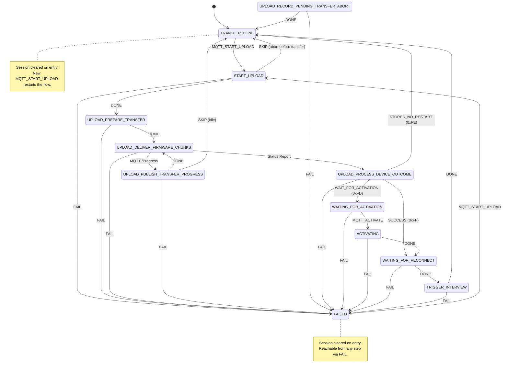

# OTA Firmware Manager

The OTA Firmware Manager drives Z-Wave firmware updates over-the-air. This page is organised so you can jump to the part that matches what you're trying to do — use it as a client, understand the internal design, or operate/debug it.

## Contents

1. [Overview](#overview) — what OTA does and what the network needs to know first.
2. [Using OTA over MQTT](#using-ota-over-mqtt) — client-facing guide: end-to-end example, commands, status values.
3. [How it works](#how-it-works) — architecture, states, steps, events, session model.
4. [Upload lifecycle](#upload-lifecycle) — starting, aborting, threading, attribute-store interaction.
5. [Error handling](#error-handling) — rejection reasons, failure modes.
6. [MQTT API](#mqtt-api) — authoritative list of topics and payload conventions.
7. [Implementation notes](#implementation-notes) — synchronous paths, dependencies, logging.

## Overview

The OTA Firmware Manager component orchestrates Z-Wave firmware updates over the air using Command Class Firmware Update Meta Data (MD). It loads a firmware image from a local cache, negotiates the update with the device via **Firmware Update MD Request Get**, then serves the image in **Firmware Update MD Report** frames when the device requests chunks via **Firmware Update MD Get**. The flow is implemented as a state machine with a dedicated worker thread; MQTT commands and reports integrate with external tools for image management, upload control, progress, and abort.

Multiple OTA sessions can exist simultaneously, but only one **active data-transfer** session is allowed at a time. A new **Start Firmware Upload** is accepted as long as no existing session is in `START_UPLOAD`, `UPLOAD_PREPARE_TRANSFER`, `UPLOAD_DELIVER_FIRMWARE_CHUNKS`, `UPLOAD_PUBLISH_TRANSFER_PROGRESS`, `UPLOAD_RECORD_PENDING_TRANSFER_ABORT`, or `UPLOAD_PROCESS_DEVICE_OUTCOME`. Sessions in passive post-transfer states (`WAITING_FOR_ACTIVATION`, `ACTIVATING`, `WAITING_FOR_RECONNECT`, `TRIGGER_INTERVIEW`) do not block new starts for different nodes. A new start for a node that **already has an active session** is always rejected with an MQTT error report (`update_already_in_progress`); abort it first.

**Prerequisite — Firmware MD in the attribute store:** The fields under `FIRMWARE_MD_REPORT_GROUP` (manufacturer ID, firmware ID, max fragment size, hardware version, number of targets, upgradable flag, and related Meta Data) are **not** collected by the OTA component. They are written to the attribute store when the node is **interviewed** (the Device Interviewer drives discovery of Command Class Firmware Update Meta Data and persists reports there). OTA **reads** those stored values at the start of an upload to build **Firmware Update MD Request Get**; if the group is missing or the interview never ran, start upload fails (e.g. `unsupported_feature`). See also `components/device_interviewer/docs/device_interviewer.md`.

## Using OTA over MQTT

Everything in this section is from the point of view of an MQTT client (a UI, script, or integration) driving ZPC. Unless stated otherwise, every topic is relative to `zpc/<home_id>/`.

### End-to-end example

The following illustrates a minimal MQTT sequence. Replace `<home_id>` with your network's eight-character hex id (e.g. `F673AEBB`), use the target Z-Wave node id in the per-node topic path where `<node>` appears, and adjust host/port to your broker. All full topic paths are `zpc/<home_id>/…` plus the suffix shown.

**1. Subscriptions (before you start)**

Subscribe so you can observe results:

| What | Topic suffix |
|------|----------------|
| Upload result | `OTA/UploadImage/Report` |
| Start negotiation result | `OTA/StartFirmwareUpload/Report` |
| Progress and ZPC-side completion | `OTA/Progress/Report` |
| Device status (authoritative) | `<node>/ep0/FirmwareUpdateMd/Report/FirmwareUpdateMdStatusReport` |

**2. Cache the image**

Publish to **`OTA/UploadImage`** JSON:

```json
{
  "image_name": "device-fw.gbl",
  "data": [ /* byte array of the .gbl file */ ]
}
```

Expect **`OTA/UploadImage/Report`** with `"status": "ok"` when the file is stored.

**3. Start the update**

Publish to **`OTA/StartFirmwareUpload`** JSON:

```json
{
  "node_id": 2,
  "image_name": "device-fw.gbl",
  "wait_for_activation": false
}
```

Expect **`OTA/StartFirmwareUpload/Report`** with `"status": "accepted"` after the device accepts the **Firmware Update MD Request** (or `error` / `rejected` with a `reason`).

**4. While uploading**

Optionally **publish** any message to **`OTA/Progress`** (the body is ignored) to request a snapshot on **`OTA/Progress/Report`** while the transfer is active. A typical snapshot looks like:

```json
{"node_id":2,"image_size":65536,"current_sent":32768,"percentage":50}
```

**5. Completion**

Watch **`OTA/Progress/Report`**: it carries a `status` field such as `success`, `waiting_for_activation`, `stored_no_restart`, or `failed` when ZPC finishes processing the outcome.

**6. Activation (if `waiting_for_activation`)**

If the device reported status `0xFD` (`waiting_for_activation`), publish to **`OTA/Activate`** with `{"node_id": 2}` when ready to apply the firmware. The state machine sends **Firmware Update Activation Set**, waits for **Activation Status Report**, then probes the node with NOP frames and triggers a re-interview.

**7. Cleanup (optional)**

Publish to **`OTA/RemoveImage`** with `{"image_name": "device-fw.gbl"}` and confirm **`OTA/RemoveImage/Report`**.

### End-user MQTT usage

Connect your client to the same MQTT broker as ZPC. You need a **home id** (eight hex characters) to build `zpc/<home_id>/…` topics; if unknown, publish `{}` to `zpc/Discovery` and read `home_id` from `zpc/Discovery/Report`.

Per-node Command Class reports use `zpc/<home_id>/<node>/ep0/FirmwareUpdateMd/Report/…`, where `<node>` is the Z-Wave node id as used in the topic path. OTA commands and reports use `zpc/<home_id>/OTA/…` only.

#### Firmware MD report (during interview)

Subscribe to **FirmwareMdReport** for the node to show firmware metadata in the UI (same fields OTA later reads from the attribute store). Example topic:

`zpc/F673AEBB/2/ep0/FirmwareUpdateMd/Report/FirmwareMdReport`

Example payload:

```json
{
  "firmware_0_checksum": 0,
  "firmware_0_id": 1026,
  "firmware_upgradable": 255,
  "hardware_version": 1,
  "manufacturer_id": 0,
  "max_fragment_size": 28,
  "number_of_firmware_targets": 1,
  "vg1": [{ "firmware_id": 2 }]
}
```

`firmware_upgradable` value `255` (`0xFF`) means the device advertises firmware as upgradable per spec.

### Status values

JSON reports use a string **`status`** field where applicable. Values are defined in `components/ota/inc/ota_mqtt_constants.hpp` (`ota::mqtt_constants::status`).

| Value | Meaning |
|-------|---------|
| `ok` | Image store or remove succeeded. |
| `error` | Failure or invalid JSON; optional `reason` (or exception text on parse errors). |
| `accepted` | Device accepted the **Firmware Update MD Request**; transfer proceeds. |
| `rejected` | Device rejected the request; **`reason`** is a machine-readable code (e.g. `invalid_combination`). |
| `success` | Transfer completed successfully (device status `0xFF`). |
| `failed` | Transfer failed per device status; **`status_code`** is the raw status byte. |
| `waiting_for_activation` | Firmware stored; activation wait (`0xFD`); **`waittime`** may be set. |
| `stored_no_restart` | Firmware stored without restart (`0xFE`); **`waittime`** may be set. |
| `aborted` | Abort before/during transfer, or abort completion acknowledged. |

**Which report topics use `status`**

| Report topic | Typical `status` values |
|--------------|-------------------------|
| `OTA/UploadImage/Report` | `ok`, `error` |
| `OTA/StartFirmwareUpload/Report` | `accepted`, `rejected`, `error`, `aborted` |
| `OTA/RemoveImage/Report` | `ok`, `error` |
| `OTA/Progress/Report` | Mid-transfer snapshots may omit `status` (byte counts only) or use `aborted` during abort; completion uses `success`, `waiting_for_activation`, `stored_no_restart`, `failed`, or `aborted` |
| `OTA/Activate/Report` | `error` (JSON parse failure on the command) |

`OTA/ListImages/Report` has **no** `status` field; it returns an **`images`** array only.

## How it works

This section describes the internal design: the components involved, the state machine, and how events flow from MQTT or Z-Wave into a single OTA session.

### Architecture

The OTA Firmware Manager consists of these main parts:

1. **`update_manager`** — Main component: worker thread, thread-safe event queue, initialization, and Z-Wave report subscriptions
2. **`OtaStateMachine`** — State machine that owns a map of active `OtaSession` objects keyed by node ID and applies transitions from a central table (`register_transitions()` / `register_steps()` in `ota_state_machine.cpp`)
3. **OTA steps** — One per `OtaState` (see [Steps](#steps)); `OtaStepTransferDone` / `OtaStepFailed` reset the session when entered
4. **`OTAMqttApi`** — MQTT command subscriptions and report publishers; some commands enqueue `ota_external_event_data` on the worker queue, others are handled synchronously
5. **`OTAImageStore`** — Filesystem-backed cache for `.gbl` images under `zpc_get_config()->ota_cache_path`

#### Component structure

```
ota
├── update_manager (threading + Initializable)
│   ├── safe_queue<ota_external_event_data> (shared with MQTT thread)
│   ├── OTAMqttApi
│   ├── OtaStateMachine
│   │   ├── sessions map (std::unordered_map<node_id, OtaSession>)
│   │   └── Step registry
│   │       ├── OtaStepTransferDone
│   │       ├── OtaStepFailed
│   │       ├── OtaStepStartUpload
│   │       ├── OtaStepUploadPrepare
│   │       ├── OtaStepDeliverRequestedFirmwareChunks
│   │       ├── OtaStepPublishTransferProgress
│   │       ├── OtaStepRecordPendingTransferAbort
│   │       ├── OtaStepProcessDeviceTransferOutcome
│   │       ├── OtaStepWaitingForActivation
│   │       ├── OtaStepActivating
│   │       ├── OtaStepWaitingForReconnect
│   │       └── OtaStepTriggerInterview
│   └── OTAImageStore
└── component_connector (Firmware Update MD CC report events → queue)
```

#### Central transition table

All state transitions are declared in `OtaStateMachine::register_transitions()` (`ota_state_machine.cpp`). Steps return semantic `StepResultCode` values; the base engine resolves `(current_state, result_code)` → `next_state`.

| Code | Meaning |
|------|---------|
| `STAY` | Waiting for an external event; no transition |
| `DONE` | Step completed via its normal path |
| `SKIP` | Step was bypassed (e.g. abort before transfer, or progress publish when not uploading) |
| `FAIL` | Unrecoverable error; transitions directly to `FAILED` |

##### Complete transition table

| From state | Result code | To state |
|------------|-------------|----------|
| `START_UPLOAD` | `DONE` | `UPLOAD_PREPARE_TRANSFER` |
| `START_UPLOAD` | `SKIP` | `TRANSFER_DONE` |
| `UPLOAD_PREPARE_TRANSFER` | `DONE` | `UPLOAD_DELIVER_FIRMWARE_CHUNKS` |
| `UPLOAD_PREPARE_TRANSFER` | `FAIL` | `FAILED` |
| `UPLOAD_PUBLISH_TRANSFER_PROGRESS` | `DONE` | `UPLOAD_DELIVER_FIRMWARE_CHUNKS` |
| `UPLOAD_PUBLISH_TRANSFER_PROGRESS` | `SKIP` | `TRANSFER_DONE` |
| `UPLOAD_PUBLISH_TRANSFER_PROGRESS` | `FAIL` | `FAILED` |
| `UPLOAD_RECORD_PENDING_TRANSFER_ABORT` | `DONE` | `TRANSFER_DONE` |
| `UPLOAD_RECORD_PENDING_TRANSFER_ABORT` | `FAIL` | `FAILED` |
| `UPLOAD_DELIVER_FIRMWARE_CHUNKS` | `DONE` | `UPLOAD_PROCESS_DEVICE_OUTCOME` |
| `UPLOAD_DELIVER_FIRMWARE_CHUNKS` | `FAIL` | `FAILED` |
| `UPLOAD_PROCESS_DEVICE_OUTCOME` | `DONE` | (routed by `session.transfer_outcome`; see below) |
| `UPLOAD_PROCESS_DEVICE_OUTCOME` | `FAIL` | `FAILED` |
| `WAITING_FOR_ACTIVATION` | `DONE` | `ACTIVATING` |
| `WAITING_FOR_ACTIVATION` | `FAIL` | `FAILED` |
| `ACTIVATING` | `DONE` | `WAITING_FOR_RECONNECT` |
| `ACTIVATING` | `FAIL` | `FAILED` |
| `WAITING_FOR_RECONNECT` | `DONE` | `TRIGGER_INTERVIEW` |
| `WAITING_FOR_RECONNECT` | `FAIL` | `FAILED` |
| `TRIGGER_INTERVIEW` | `DONE` | `TRANSFER_DONE` |
| `TRIGGER_INTERVIEW` | `FAIL` | `FAILED` |

> **Note:** `FAIL` from any state routes to `FAILED`; the engine also handles unrecoverable `FAIL` via `state_machine_base::apply_transition()`.

##### Post-transfer outcome routing

`UPLOAD_PROCESS_DEVICE_OUTCOME` DONE is routed explicitly in `OtaStateMachine::process_event` based on `session.transfer_outcome`:

| `transfer_outcome` | Target state |
|---------------------|-------------|
| `SUCCESS` (0xFF) | `WAITING_FOR_RECONNECT` |
| `WAIT_FOR_ACTIVATION` (0xFD) | `WAITING_FOR_ACTIVATION` |
| `STORED_NO_RESTART` (0xFE) | `TRANSFER_DONE` |

### States

| State | Step | Description |
|-------|------|-------------|
| `TRANSFER_DONE` | OtaStepTransferDone | No active transfer; entering this state **clears** the `OtaSession`. New uploads may start when here (or from `FAILED`). |
| `FAILED` | OtaStepFailed | Terminal error; entering this state **clears** the `OtaSession`. A new `MQTT_START_UPLOAD` is allowed to start again. |
| `START_UPLOAD` | OtaStepStartUpload | Read Firmware MD attributes **already stored** from device interview, send **Firmware Update MD Request Get**, wait for **Request Report** |
| `UPLOAD_PREPARE_TRANSFER` | OtaStepUploadPrepare | Load image into `firmware_image_cache`, set transfer size, pause attribute resolution, set `upload_in_progress` |
| `UPLOAD_DELIVER_FIRMWARE_CHUNKS` | OtaStepDeliverRequestedFirmwareChunks | **Firmware Update MD Get** → **Firmware Update MD Report** loop; optional abort path with corrupted last fragment when `abort_requested` |
| `UPLOAD_PUBLISH_TRANSFER_PROGRESS` | OtaStepPublishTransferProgress | One-shot progress JSON to `OTA/Progress/Report`; returns to deliver or `SKIP` → `TRANSFER_DONE` if not uploading |
| `UPLOAD_RECORD_PENDING_TRANSFER_ABORT` | OtaStepRecordPendingTransferAbort | Sets `transfer.abort_requested`; then `DONE` → `TRANSFER_DONE` (session cleared by `OtaStepTransferDone`) |
| `UPLOAD_PROCESS_DEVICE_OUTCOME` | OtaStepProcessDeviceTransferOutcome | **Firmware Update MD Status Report** → MQTT completion; routes to post-transfer path based on `transfer_outcome` |
| `WAITING_FOR_ACTIVATION` | OtaStepWaitingForActivation | Device reported status `0xFD`; waiting for `MQTT_ACTIVATE` command to send **Firmware Update Activation Set** |
| `ACTIVATING` | OtaStepActivating | **Activation Set** sent; waiting for **Firmware Update Activation Status Report** (`0xFF` = success) |
| `WAITING_FOR_RECONNECT` | OtaStepWaitingForReconnect | Wait `session.wait_time` seconds, then NOP-probe the node with retries until ACK or max retries exhausted |
| `TRIGGER_INTERVIEW` | OtaStepTriggerInterview | Node confirmed reachable; fire `COMPONENT_CONNECTOR_NODE_INTERVIEW_REQUESTED` to trigger re-interview |

### State transition diagram



### Steps

Each step owns one `OtaState`. Sub-headings below are deliberately demoted (H4) so they stay grouped in the right-sidebar TOC.

#### OtaStepTransferDone (`TRANSFER_DONE`)

**Purpose:** Terminal "success / idle" state. **`on_enter`** captures the endpoint node and resumes attribute resolution for the endpoint if it was valid. After the step returns, `OtaStateMachine::process_event` **erases** the session entry from the `sessions` map.

**Handles events:** none (`handles_external_event` is always false).

#### OtaStepFailed (`FAILED`)

**Purpose:** Terminal failure state. **`on_enter`** resumes attribute resolution for the endpoint if it was valid. After the step returns, `OtaStateMachine::process_event` **erases** the session entry from the `sessions` map. A new `MQTT_START_UPLOAD` for the same node is accepted once the entry is removed.

**Handles events:** none.

#### OtaStepStartUpload (`START_UPLOAD`)

**Entry point:** After `MQTT_START_UPLOAD`, `start_ota()` builds a new `OtaSession` and transitions here.

**Purpose:** Resolve endpoint 0, read **persisted** Firmware MD attributes from the attribute store, load the image from `OTAImageStore`, compute CRC16, and send **Firmware Update MD Request Get**.

**Handles events:**

- `FIRMWARE_UPDATE_MD_REQUEST_REPORT_RECEIVED` — valid combo → `DONE` → `UPLOAD_PREPARE_TRANSFER`; else reject and `FAIL`
- `MQTT_ABORT` — publish `aborted`, `SKIP` → `TRANSFER_DONE`

#### OtaStepUploadPrepare (`UPLOAD_PREPARE_TRANSFER`)

**Purpose:** Load image bytes into `session.firmware_image_cache`, set `transfer.image_size`, reset `abort_requested`, pause attribute resolution, set `upload_in_progress = true`, then `DONE` → `UPLOAD_DELIVER_FIRMWARE_CHUNKS`.

#### OtaStepDeliverRequestedFirmwareChunks (`UPLOAD_DELIVER_FIRMWARE_CHUNKS`)

**Purpose:** Respond to **Firmware Update MD Get** with **Firmware Update MD Report** batches; update `bytes_transferred`. If `transfer.abort_requested`, send corrupted last fragment per spec and publish progress with `aborted`. Invalid MD Get or fatal errors → `FAIL` → `FAILED`.

#### OtaStepPublishTransferProgress (`UPLOAD_PUBLISH_TRANSFER_PROGRESS`)

**Purpose:** Enqueued when the user publishes to **`OTA/Progress`**. **`on_enter`** publishes a progress snapshot; if `upload_in_progress`, `DONE` returns to `UPLOAD_DELIVER_FIRMWARE_CHUNKS`, otherwise `SKIP` → `TRANSFER_DONE`.

#### OtaStepRecordPendingTransferAbort (`UPLOAD_RECORD_PENDING_TRANSFER_ABORT`)

**Purpose:** Sets `session.transfer.abort_requested = true`, then `DONE` → `TRANSFER_DONE` (**`OtaStepTransferDone`** clears the session). Used when **`MQTT_ABORT`** is processed by the state machine.

#### OtaStepProcessDeviceTransferOutcome (`UPLOAD_PROCESS_DEVICE_OUTCOME`)

**Purpose:** Handle **Firmware Update MD Status Report**; publish completion on `OTA/Progress/Report`, clear cached image. Sets `session.transfer_outcome` and `session.wait_time` based on the device status byte. The state machine routes `DONE` to one of three post-transfer paths (see [Post-transfer outcome routing](#post-transfer-outcome-routing)). `FAIL` → `FAILED` on non-success status or bad payload.

#### OtaStepWaitingForActivation (`WAITING_FOR_ACTIVATION`)

**Purpose:** Entered when the device reports status `0xFD` (firmware stored, waiting for activation). The step waits for an `MQTT_ACTIVATE` event, then sends **Firmware Update Activation Set** via component connector with the session's manufacturer ID, firmware ID, checksum, firmware target, and hardware version.

**Handles events:**

- `MQTT_ACTIVATE` — send Activation Set → `DONE` → `ACTIVATING`

#### OtaStepActivating (`ACTIVATING`)

**Purpose:** Waits for **Firmware Update Activation Status Report** after the Activation Set was sent. On `0xFF` (success), carries `wait_time` into the session and proceeds to `WAITING_FOR_RECONNECT`. Non-success status publishes a `failed` progress report and returns `FAIL`.

**Handles events:**

- `FIRMWARE_UPDATE_ACTIVATION_STATUS_REPORT` — success → `DONE` → `WAITING_FOR_RECONNECT`; failure → `FAIL` → `FAILED`

#### OtaStepWaitingForReconnect (`WAITING_FOR_RECONNECT`)

**Purpose:** After successful activation (or immediate restart on `0xFF`), waits `session.wait_time` seconds, then sends NOP frames to verify the node is reachable. Retries up to 60 times with 5-second intervals. On ACK → `DONE` → `TRIGGER_INTERVIEW`. If all retries are exhausted → `FAIL`.

**Handles events:** none (all work is done synchronously in `on_enter`).

#### OtaStepTriggerInterview (`TRIGGER_INTERVIEW`)

**Purpose:** Node is confirmed reachable after firmware update. Fires `COMPONENT_CONNECTOR_NODE_INTERVIEW_REQUESTED` via component connector to trigger the Device Interviewer to re-interview the node with updated firmware metadata.

**Handles events:** none (work is done in `on_enter`).

### Events

#### Event types

| Event | Description | Payload Type |
|-------|-------------|----------------|
| `MQTT_START_UPLOAD` | Start firmware upload for a node | `StartFirmwareUploadPayload` |
| `MQTT_ABORT` | Abort transfer for a specific node | JSON with `node_id` (required; routes to the matching session) |
| `MQTT_ACTIVATE` | Request activation for a node | `ActivatePayload` |
| `MQTT_PROGRESS_REQUEST` | Request progress snapshot | optional JSON with `node_id`; defaults to first in-progress session if absent or `0` |
| `FIRMWARE_MD_REPORT_RECEIVED` | Firmware MD Report parsed (subscribed) | `ZwaveReportPayload` |
| `FIRMWARE_UPDATE_MD_REQUEST_REPORT_RECEIVED` | Request Report after Request Get | `ZwaveReportPayload` |
| `FIRMWARE_UPDATE_MD_GET_RECEIVED` | Device requests chunk(s) | `ZwaveReportPayload` |
| `FIRMWARE_UPDATE_MD_STATUS_REPORT_RECEIVED` | Final transfer status from device | `ZwaveReportPayload` |
| `FIRMWARE_UPDATE_ACTIVATION_STATUS_REPORT` | Activation status from device | `ZwaveReportPayload` |

`ZwaveReportPayload` carries `node_id`, `endpoint_node`, and `attribute_map` for Firmware Update MD attributes.

> **Note:** `FIRMWARE_MD_REPORT_RECEIVED` is subscribed for parity with the CC pipeline; the start step reads **already persisted** Firmware MD attributes from the attribute store (written during interview).

#### Event flow

```mermaid
flowchart TD
    A["Z-Wave CC / MQTT callback"] -->|queue_event() / push ota_external_event_data| B["safe_queue&lt;ota_external_event_data&gt;<br/>(thread-safe)"]
    B -->|"update_manager::run() pops (50 ms timeout)"| C["OtaStateMachine::process_event()"]
    C -->|"Routes: start, abort, progress request, or current step"| D["Step::handle_event()"]
    D -->|Returns StepResult| E["apply_transition() (if not STAY)"]
```

### Session

Each transfer uses one `OtaSession` (`update_manager_types.hpp`):

- **Identity:** `node_id`, `endpoint_node`
- **State:** `current_state` (`OtaState`)
- **Flags:** `upload_in_progress`
- **Upload request:** `upload` (`image_name`, `wait_for_activation`, `firmware_target`)
- **Transfer:** `transfer` (`image_size`, `bytes_transferred`, `abort_requested`, `firmware_checksum`, …)
- **Device metadata:** `firmware_md` (manufacturer ID, firmware ID, `max_fragment_size`, hardware version, targets, upgradable flag)
- **Cache:** `firmware_image_cache` (image bytes for the active transfer)
- **Post-transfer:** `wait_time` (seconds from Status Report or Activation Status Report), `transfer_outcome` (routing signal for post-transfer states)

When a session reaches **`TRANSFER_DONE`** or **`FAILED`**, `OtaStateMachine::process_event` **erases** the entry from the `sessions` map. The step's `on_enter` still resumes attribute resolution for the endpoint before the map entry is removed.

## Upload lifecycle

This section covers operational concerns that apply across states: how uploads start and stop, and how the OTA component interacts with threading and the attribute store.

### Starting an upload

1. The target node should be **included and interviewed** so Firmware MD attributes exist in the attribute store (see **Prerequisite** in Overview).
2. Client stores a `.gbl` image via **OTA/UploadImage** (synchronous store + report).
3. Client publishes **OTA/StartFirmwareUpload** with `node_id`, `image_name`, optional `wait_for_activation`.
4. If the machine accepts the request, `MQTT_START_UPLOAD` is handled on the worker thread: `start_ota()` assigns a new `OtaSession` and transitions to `START_UPLOAD`.

**When start is rejected:** A new start is rejected with `update_already_in_progress` if (a) the same node already has an entry in the `sessions` map (regardless of its state — abort it first), or (b) any existing session is in an active data-transfer state (`START_UPLOAD`, `UPLOAD_PREPARE_TRANSFER`, `UPLOAD_DELIVER_FIRMWARE_CHUNKS`, `UPLOAD_PUBLISH_TRANSFER_PROGRESS`, `UPLOAD_RECORD_PENDING_TRANSFER_ABORT`, `UPLOAD_PROCESS_DEVICE_OUTCOME`).

**When start is accepted:** `start_ota()` inserts a new `OtaSession` into the `sessions` map for the target node and transitions it to `START_UPLOAD`. Sessions in passive states (`WAITING_FOR_ACTIVATION`, `ACTIVATING`, `WAITING_FOR_RECONNECT`, `TRIGGER_INTERVIEW`) for other nodes do not block the new start.

### Aborting an upload

- **`MQTT_ABORT`** is handled early in `OtaStateMachine::process_event`. The payload **must** include a `node_id` (e.g. `{"node_id": 2}`) to route to the correct session; without it the event is rejected with a log error. The matching session transitions to **`UPLOAD_RECORD_PENDING_TRANSFER_ABORT`**, the step sets `transfer.abort_requested`, returns `DONE` → **`TRANSFER_DONE`**, and the session is erased from the map (no further chunk delivery in that path).
- **Before transfer** (`START_UPLOAD`): **`MQTT_ABORT`** can be handled inside **`OtaStepStartUpload`** — publishes `aborted`, `SKIP` → **`TRANSFER_DONE`**.
- **`OtaStepDeliverRequestedFirmwareChunks`**: If `transfer.abort_requested` is true when processing **Firmware Update MD Get**, the step sends a corrupted last **MD Report** per spec (relevant when the session is still in the deliver state with that flag set; the top-level **`MQTT_ABORT`** path above clears the session via **`TRANSFER_DONE`** instead).

### Thread safety

- **Event queue:** `threading::safe_queue<ota_external_event_data>` shared between MQTT callbacks and the OTA worker thread.
- **Worker thread:** `update_manager::run()` pops events; all state transitions and step logic run on this thread.
- **Synchronous MQTT paths:** `UploadImage`, `ListImages`, `RemoveImage` handle storage and publish reports without entering the state machine.

### Attribute store integration

**Where the data comes from:** Firmware Update Meta Data is discovered when the device is **interviewed** (Z-Wave reports are handled by the Firmware Update MD command class and persisted under the node). The OTA manager does not run that discovery; it assumes endpoint 0 already has a valid `FIRMWARE_MD_REPORT_GROUP` (and related types) after a successful interview.

**What OTA reads at start:** Under the node's endpoint 0, including:

- `FIRMWARE_MD_REPORT_GROUP` attributes: manufacturer ID, firmware IDs, max fragment size, hardware version, number of firmware targets, firmware upgradable flag

**Pause / resume:** **`OtaStepUploadPrepare`** pauses attribute resolution for the endpoint and sets `session.resolution_paused = true`. The resume is called exactly once per pause, guarded by that flag. On the normal path the resume happens in **`OtaStepTransferDone::on_enter`** or **`OtaStepFailed::on_enter`** (flag captured before the session is reset). On the activation path, **`OtaStepWaitingForActivation::on_enter`** resumes early (so the stack can exchange other commands while waiting for the MQTT Activate command) and clears `resolution_paused`; `TransferDone` / `Failed` then skip the resume because the flag is already false.

## Error handling

### Stale or ignored events

- `MQTT_START_UPLOAD` with invalid payload or `node_id == 0` is rejected or ignored as implemented in `OTAMqttApi` / state machine.
- Z-Wave events are only accepted by the current step when `handles_external_event` returns true for that event type.
- `MQTT_PROGRESS_REQUEST` routes to the session for the `node_id` in the payload. If `node_id` is absent or `0`, it falls back to the first session with `upload_in_progress == true`. If no such session exists the request is silently ignored. Otherwise the matched session transitions to **`UPLOAD_PUBLISH_TRANSFER_PROGRESS`**; if the session is not actively uploading, the publish step **`SKIP`s** to **`TRANSFER_DONE`**.

### Request Report rejection

Device rejection codes (SDS13782) are mapped to MQTT `reason` strings (e.g. `invalid_combination`, `requires_authentication`, `invalid_fragment_size`, `not_downloadable`, `invalid_hardware_version`).

### Status Report failures

Non-success status codes from **Firmware Update MD Status Report** are published on the progress report with `status` `failed` and `status_code` set to the raw byte value where applicable.

### Activation failures

Non-success status (`!= 0xFF`) from **Firmware Update Activation Status Report** publishes `failed` with the raw `status_code` on `OTA/Progress/Report` and transitions to `FAILED`.

## MQTT API

Topic names, direction, and payload schemas are defined in the AsyncAPI contract and rendered in [OTA MQTT API](ota_mqtt_api.md). Do not edit that page by hand.

### Payload conventions (JSON keys)

Common strings are defined in `ota_mqtt_constants.hpp`:

| Key | Usage |
|-----|--------|
| `node_id` | Z-Wave node ID |
| `image_name` | Cached file name |
| `status` | `ok`, `error`, `accepted`, `rejected`, `success`, `failed`, `waiting_for_activation`, `stored_no_restart`, `aborted`, … |
| `reason` | Machine-readable failure reason |
| `image_size`, `current_sent`, `percentage` | Progress |
| `waittime` | Wait time from status report where applicable |
| `status_code` | Raw firmware status byte on failure |
| `wait_for_activation` | Boolean on start command |

### Progress: command triggers the report

Progress is a **request/response** pair over MQTT:

1. **Subscribe** to `…/OTA/Progress/Report` so you receive progress JSON from ZPC.
2. **Publish** any message to `…/OTA/Progress` (payload is ignored). That enqueues `MQTT_PROGRESS_REQUEST`; the state machine transitions to **`UPLOAD_PUBLISH_TRANSFER_PROGRESS`**, which publishes to **`OTA/Progress/Report`** when `transfer.image_size` is non-zero and returns to **`UPLOAD_DELIVER_FIRMWARE_CHUNKS`** if a transfer is active.

If no upload is in progress, the publish step **`SKIP`s** to **`TRANSFER_DONE`** (no meaningful progress).

The same **`OTA/Progress/Report`** topic is used when the transfer finishes, aborts, or reports final status.

**Example** — during an active upload, a snapshot may look like:

```json
{"node_id":2,"image_size":65536,"current_sent":32768,"percentage":50}
```

## Implementation notes

### Synchronous operations

These do not use the OTA state machine:

- **OTA/UploadImage** — `OTAImageStore::store_image` (only `.gbl` names allowed; path traversal rejected; max 10 MB)
- **OTA/ListImages** — Directory listing of the cache path
- **OTA/RemoveImage** — File removal

### Dependencies

- **Device interview (upstream)**: Populates `FIRMWARE_MD_REPORT_GROUP` and related Firmware MD attributes before OTA can negotiate an update
- **Component Connector**: Firmware Update MD CC events (`command_class_firmware_update_md_events.hpp`), re-interview trigger (`component_connector_common_events.hpp`)
- **Attribute Store / Network Helper**: Endpoint resolution, Firmware MD attributes
- **Threading**: `threading::threading`, `safe_queue`
- **MQTT**: `MqttApiBase` for subscriptions and reports
- **State machine**: `state_machine_base` (`StepResultCode`, transition table)
- **Z-Wave TX**: NOP probe in `OtaStepWaitingForReconnect`

### Logging

| Log tag | Component |
|---------|-----------|
| `ota_update_manager` | `update_manager` |
| `ota_state_machine` | `OtaStateMachine` |
| `ota_mqtt_api` | `OTAMqttApi` |
| `ota_image_store` | `OTAImageStore` |
| `ota_step_transfer_done` | `OtaStepTransferDone` |
| `ota_step_failed` | `OtaStepFailed` |
| `ota_step_start_upload` | `OtaStepStartUpload` |
| `ota_step_upload_prepare` | `OtaStepUploadPrepare` |
| `ota_step_deliver_requested_firmware_chunks` | `OtaStepDeliverRequestedFirmwareChunks` |
| `ota_step_publish_transfer_progress` | `OtaStepPublishTransferProgress` |
| `ota_step_record_pending_transfer_abort` | `OtaStepRecordPendingTransferAbort` |
| `ota_step_process_device_transfer_outcome` | `OtaStepProcessDeviceTransferOutcome` |
| `ota_step_waiting_for_activation` | `OtaStepWaitingForActivation` |
| `ota_step_activating` | `OtaStepActivating` |
| `ota_step_waiting_for_reconnect` | `OtaStepWaitingForReconnect` |
| `ota_step_trigger_interview` | `OtaStepTriggerInterview` |
